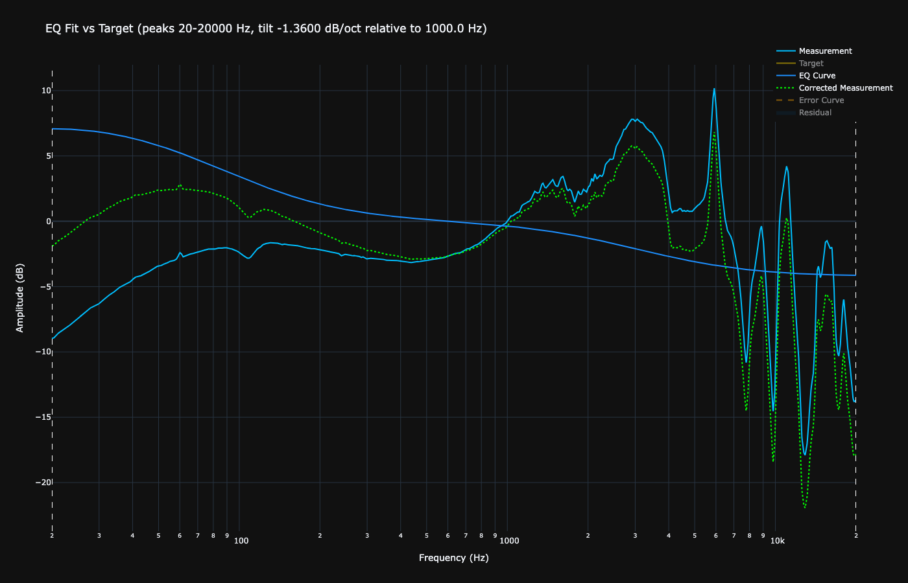

# Energy-Balanced Headphone EQ Profiles

## Diffuse-Field Target as a Headphone

The classic Diffuse-Field (DF) target has been used for decades as a reference for neutral headphone tuning. 

If we take that same DF curve and force it to deliver uniform energy when reproducing white noise, this is what it needs:

<div align="center">
  
</div>

```text
Preamp: -0.3 dB  
Filter 1: ON PK Fc 43.69 Hz Gain -0.91 dB Q 0.172  
Filter 2: ON PK Fc 1173.98 Hz Gain 2.83 dB Q 1.490  
Filter 3: ON PK Fc 20000.00 Hz Gain -3.97 dB Q 0.015  
```

This shows that even the DF target contains excess treble energy when judged by uniform power delivery. Many "neutral" headphones carry a version of this skew.

## What Energy-Balanced Means

These EQ profiles correct headphones so they deliver uniform acoustic energy across frequencies (flat power per Hz, measured frame by frame against white noise).

Instead of chasing a visually flat dB curve or a perceptual target (Harman, DF, etc.), the goal is consistent energy distribution. This reduces masking between frequency bands and preserves natural transients.

The result is usually:
- Tighter and more authoritative bass without bloom
- Natural mids that sit correctly without emphasis
- Clear but relaxed treble without fatigue
- Better imaging and a more open, out-of-head presentation

All EQs use only broad filters to avoid ringing and phase artifacts.

## Headphone EQ Profiles

<details>
  <summary><strong>ADAM Audio H200</strong></summary>

  <div align="center">
    
  </div>

```text
Preamp: -9.9 dB
Filter 1: ON PK Fc 37.92 Hz Gain -24.00 dB Q 0.390
Filter 2: ON PK Fc 15107.49 Hz Gain 9.93 dB Q 0.196
```

</details>

<details>
  <summary><strong>AKG K361</strong></summary>

  <div align="center">
    
  </div>

```text
Preamp: -9.4 dB
Filter 1: ON PK Fc 20.00 Hz Gain -5.74 dB Q 0.092
Filter 2: ON PK Fc 18123.73 Hz Gain 9.40 dB Q 0.570
```

</details>

<details>
  <summary><strong>AKG K702</strong></summary>

  <div align="center">
    
  </div>

```text
Preamp: -1.4 dB
Filter 1: ON PK Fc 20.00 Hz Gain 1.37 dB Q 1.574
Filter 2: ON PK Fc 20000.00 Hz Gain -7.52 dB Q 0.037
```

</details>

<details>
  <summary><strong>Audeze LCD-S20</strong></summary>

  <div align="center">
    
  </div>

```text
Preamp: -3.6 dB
Filter 1: ON PK Fc 120.46 Hz Gain -1.39 dB Q 0.061
Filter 2: ON PK Fc 19635.72 Hz Gain 3.59 dB Q 0.036
```

</details>

<details>
  <summary><strong>Audeze LCD-X</strong></summary>

  <div align="center">
    
  </div>

```text
Preamp: -7.5 dB
Filter 1: ON PK Fc 20.00 Hz Gain 7.46 dB Q 0.636
Filter 2: ON PK Fc 20000.00 Hz Gain -3.46 dB Q 0.061
```

</details>

<details>
  <summary><strong>Audeze LCD-XC</strong></summary>

  <div align="center">
    
  </div>

```text
Preamp: -3.7 dB
Filter 1: ON PK Fc 20.00 Hz Gain 3.71 dB Q 0.250
Filter 2: ON PK Fc 20000.00 Hz Gain -5.88 dB Q 0.037
```

</details>

<details>
  <summary><strong>Audeze MM-100</strong></summary>

  <div align="center">
    
  </div>

```text
Preamp: -8.6 dB
Filter 1: ON PK Fc 20.00 Hz Gain 8.55 dB Q 0.157
Filter 2: ON PK Fc 20000.00 Hz Gain -2.47 dB Q 0.068
```

</details>

<details>
  <summary><strong>Audeze MM-500</strong></summary>

  <div align="center">
    
  </div>

```text
Preamp: -6.7 dB
Filter 1: ON PK Fc 20.00 Hz Gain 6.68 dB Q 0.207
Filter 2: ON PK Fc 20000.00 Hz Gain -2.98 dB Q 0.040
```

</details>

<details>
  <summary><strong>Audio-Technica ATH-R70x</strong></summary>

  <div align="center">
    
  </div>

```text
Preamp: -7.1 dB
Filter 1: ON PK Fc 20.00 Hz Gain 7.08 dB Q 0.272
Filter 2: ON PK Fc 20000.00 Hz Gain -4.82 dB Q 0.044
```

</details>

<details>
  <summary><strong>Beyerdynamic DT 1770 Pro</strong></summary>

  <div align="center">
    
  </div>

```text
Preamp: -4.3 dB
Filter 1: ON PK Fc 29.04 Hz Gain -2.21 dB Q 0.350
Filter 2: ON PK Fc 17989.16 Hz Gain 4.28 dB Q 0.916
```

</details>

<details>
  <summary><strong>Beyerdynamic DT 270 Pro</strong></summary>

  <div align="center">
    
  </div>

```text
Preamp: -1.5 dB
Filter 1: ON PK Fc 20.00 Hz Gain 1.55 dB Q 0.608
Filter 2: ON PK Fc 20000.00 Hz Gain -3.21 dB Q 0.033
```

</details>

<details>
  <summary><strong>Beyerdynamic DT 700 Pro X</strong></summary>

  <div align="center">
    
  </div>

```text
Preamp: -5.6 dB
Filter 1: ON PK Fc 20.00 Hz Gain -9.09 dB Q 0.078
Filter 2: ON PK Fc 19527.42 Hz Gain 5.63 dB Q 0.062
```

</details>

<details>
  <summary><strong>Beyerdynamic MMX 300 (2nd Gen)</strong></summary>

  <div align="center">
    
  </div>

```text
Preamp: -0.4 dB
Filter 1: ON PK Fc 1264.39 Hz Gain 0.89 dB Q 2.666
Filter 2: ON PK Fc 20000.00 Hz Gain -2.87 dB Q 0.047
```

</details>

<details>
  <summary><strong>Dan Clark Audio Aeon 2 Closed</strong></summary>

  <div align="center">
    
  </div>

```text
Preamp: -1.6 dB
Filter 1: ON PK Fc 22.27 Hz Gain 0.17 dB Q 2.996
Filter 2: ON PK Fc 19579.26 Hz Gain 1.62 dB Q 0.068
```

</details>

<details>
  <summary><strong>DUNU Arashi</strong></summary>

  <div align="center">
    
  </div>

```text
Preamp: -9.5 dB
Filter 1: ON PK Fc 20.00 Hz Gain 9.50 dB Q 0.919
Filter 2: ON PK Fc 20000.00 Hz Gain -9.74 dB Q 0.280
```

</details>

<details>
  <summary><strong>Drop + grell OAE1</strong></summary>

  <div align="center">
    
  </div>

```text
Preamp: -4.4 dB
Filter 1: ON PK Fc 60.73 Hz Gain -5.58 dB Q 0.082
Filter 2: ON PK Fc 1439.86 Hz Gain 1.89 dB Q 0.089
Filter 3: ON PK Fc 19186.20 Hz Gain 3.58 dB Q 0.097
```

</details>

<details>
  <summary><strong>FIIO FT1 Pro</strong></summary>

  <div align="center">
    
  </div>

```text
Preamp: -9.7 dB
Filter 1: ON PK Fc 20.00 Hz Gain 9.73 dB Q 0.658
Filter 2: ON PK Fc 20000.00 Hz Gain -4.98 dB Q 0.089
```

</details>

<details>
  <summary><strong>FIIO FT7</strong></summary>

  <div align="center">
    
  </div>

```text
Preamp: -3.5 dB
Filter 1: ON PK Fc 20.00 Hz Gain 3.51 dB Q 0.041
Filter 2: ON PK Fc 12203.03 Hz Gain -4.04 dB Q 0.152
```

</details>

<details>
  <summary><strong>FIIO JT1</strong></summary>

  <div align="center">
    
  </div>

```text
Preamp: -1.5 dB
Filter 1: ON PK Fc 47.14 Hz Gain -12.70 dB Q 0.872
Filter 2: ON PK Fc 5746.85 Hz Gain 1.45 dB Q 0.010
```

</details>

<details>
  <summary><strong>FIIO JT7</strong></summary>

  <div align="center">
    
  </div>

```text
Preamp: -4.6 dB
Filter 1: ON PK Fc 20.00 Hz Gain 4.58 dB Q 1.533
Filter 2: ON PK Fc 20000.00 Hz Gain -5.24 dB Q 0.037
```

</details>

<details>
  <summary><strong>Focal Clear MG Professional</strong></summary>

  <div align="center">
    
  </div>

```text
Preamp: -7.1 dB
Filter 1: ON PK Fc 20.00 Hz Gain 7.08 dB Q 0.216
Filter 2: ON PK Fc 20000.00 Hz Gain -4.14 dB Q 0.052
```

</details>

<details>
  <summary><strong>Fostex T50RP mk4</strong></summary>

  <div align="center">
    
  </div>

```text
Preamp: -12.4 dB
Filter 1: ON PK Fc 20.00 Hz Gain 12.37 dB Q 0.310
Filter 2: ON PK Fc 15985.75 Hz Gain -5.30 dB Q 0.708
```

</details>

<details>
  <summary><strong>HarmonicDyne Romantic</strong></summary>

  <div align="center">
    
  </div>

```text
Preamp: -4.5 dB
Filter 1: ON PK Fc 20.76 Hz Gain 1.27 dB Q 0.215
Filter 2: ON PK Fc 19265.12 Hz Gain 4.50 dB Q 1.378
```

</details>

<details>
  <summary><strong>HarmonicDyne x Z Reviews Eris</strong></summary>

  <div align="center">
    
  </div>

```text
Preamp: -15.5 dB
Filter 1: ON PK Fc 59.03 Hz Gain -23.95 dB Q 0.333
Filter 2: ON PK Fc 18579.03 Hz Gain 15.50 dB Q 0.345
```

</details>

<details>
  <summary><strong>HEDD Audio HEDDphone D1</strong></summary>

  <div align="center">
    
  </div>

```text
Preamp: -4.9 dB
Filter 1: ON PK Fc 20.00 Hz Gain 4.92 dB Q 0.705
Filter 2: ON PK Fc 8242.75 Hz Gain -4.78 dB Q 0.254
```

</details>

<details>
  <summary><strong>HEDD Audio HEDDphone TWO</strong></summary>

  <div align="center">
    
  </div>

```text
Preamp: -3.1 dB
Filter 1: ON PK Fc 20.00 Hz Gain 3.13 dB Q 0.259
Filter 2: ON PK Fc 20000.00 Hz Gain -2.77 dB Q 0.041
```

</details>

<details>
  <summary><strong>HIFIMAN Ananda Nano</strong></summary>

  <div align="center">
    
  </div>

```text
Preamp: -0.7 dB
Filter 1: ON PK Fc 21.05 Hz Gain 0.72 dB Q 3.000
Filter 2: ON PK Fc 12053.32 Hz Gain 0.21 dB Q 0.015
```

</details>

<details>
  <summary><strong>HIFIMAN Ananda Unveiled</strong></summary>

  <div align="center">
    
  </div>

```text
Preamp: -3.4 dB
Filter 1: ON PK Fc 20.00 Hz Gain 3.45 dB Q 0.226
Filter 2: ON PK Fc 16416.76 Hz Gain -2.80 dB Q 0.265
```

</details>

<details>
  <summary><strong>HIFIMAN Arya Organic</strong></summary>

  <div align="center">
    
  </div>

```text
Preamp: 0.1 dB
Filter 1: ON PK Fc 64.68 Hz Gain -3.72 dB Q 0.525
Filter 2: ON PK Fc 20000.00 Hz Gain -2.08 dB Q 0.098
```

</details>

<details>
  <summary><strong>HIFIMAN Arya Unveiled</strong></summary>

  <div align="center">
    
  </div>

```text
Preamp: -0.9 dB
Filter 1: ON PK Fc 24.32 Hz Gain 0.87 dB Q 2.794
Filter 2: ON PK Fc 19506.64 Hz Gain -2.86 dB Q 0.083
```

</details>

<details>
  <summary><strong>HIFIMAN Edition XS</strong></summary>

  <div align="center">
    
  </div>

```text
Preamp: 0.1 dB
Filter 1: ON PK Fc 90.20 Hz Gain -1.69 dB Q 0.580
Filter 2: ON PK Fc 17371.49 Hz Gain -1.91 dB Q 0.139
```

</details>

<details>
  <summary><strong>HIFIMAN Edition XV</strong></summary>

  <div align="center">
    
  </div>

```text
Preamp: -2.8 dB
Filter 1: ON PK Fc 20.00 Hz Gain 2.78 dB Q 0.401
Filter 2: ON PK Fc 20000.00 Hz Gain -1.56 dB Q 0.084
```

</details>

<details>
  <summary><strong>HIFIMAN HE1000 Unveiled</strong></summary>

  <div align="center">
    
  </div>

```text
Preamp: 0.3 dB
Filter 1: ON PK Fc 73.50 Hz Gain -1.91 dB Q 0.336
Filter 2: ON PK Fc 16217.48 Hz Gain -1.31 dB Q 0.093
```

</details>

<details>
  <summary><strong>HIFIMAN HE560</strong></summary>

  <div align="center">
    
  </div>

```text
Preamp: -4.0 dB
Filter 1: ON PK Fc 20.00 Hz Gain 3.97 dB Q 0.136
Filter 2: ON PK Fc 19999.94 Hz Gain -2.99 dB Q 0.099
```

</details>

<details>
  <summary><strong>HIFIMAN HE600</strong></summary>

  <div align="center">
    
  </div>

```text
Preamp: -4.2 dB
Filter 1: ON PK Fc 20.00 Hz Gain 4.23 dB Q 0.122
Filter 2: ON PK Fc 20000.00 Hz Gain -4.41 dB Q 0.111
```

</details>

<details>
  <summary><strong>HIFIMAN Sundara</strong></summary>

  <div align="center">
    
  </div>

```text
Preamp: -1.3 dB
Filter 1: ON PK Fc 20.00 Hz Gain 1.29 dB Q 0.150
Filter 2: ON PK Fc 16981.07 Hz Gain -2.92 dB Q 0.154
```

</details>

<details>
  <summary><strong>HIFIMAN Sundara Closed-Back</strong></summary>

  <div align="center">
    
  </div>

```text
Preamp: -9.1 dB
Filter 1: ON PK Fc 20.00 Hz Gain 9.10 dB Q 0.305
Filter 2: ON PK Fc 20000.00 Hz Gain -3.34 dB Q 0.109
```

</details>

<details>
  <summary><strong>HIFIMAN Sundara Silver</strong></summary>

  <div align="center">
    
  </div>

```text
Preamp: -5.1 dB
Filter 1: ON PK Fc 20.00 Hz Gain 2.82 dB Q 1.384
Filter 2: ON PK Fc 20.00 Hz Gain 2.31 dB Q 0.032
Filter 3: ON PK Fc 20000.00 Hz Gain -5.41 dB Q 0.054
```

</details>

<details>
  <summary><strong>HIFIMAN Susvara Unveiled</strong></summary>

  <div align="center">
    
  </div>

```text
Preamp: 0.2 dB
Filter 1: ON PK Fc 33.72 Hz Gain -1.55 dB Q 0.141
Filter 2: ON PK Fc 15342.46 Hz Gain -0.37 dB Q 0.085
```

</details>

<details>
  <summary><strong>Meze Audio 105 AER</strong></summary>

  <div align="center">
    
  </div>

```text
Preamp: 0.2 dB
Filter 1: ON PK Fc 82.14 Hz Gain -3.01 dB Q 0.440
Filter 2: ON PK Fc 19983.54 Hz Gain -1.51 dB Q 0.070
```

</details>

<details>
  <summary><strong>Meze Audio 109 Pro</strong></summary>

  <div align="center">
    
  </div>

```text
Preamp: -4.1 dB
Filter 1: ON PK Fc 20.00 Hz Gain 4.08 dB Q 0.824
Filter 2: ON PK Fc 12414.91 Hz Gain -2.62 dB Q 0.365
```

</details>

<details>
  <summary><strong>Meze Audio 99 CLASSICS</strong></summary>

  <div align="center">
    
  </div>

```text
Preamp: -10.2 dB
Filter 1: ON PK Fc 50.18 Hz Gain -24.00 dB Q 0.316
Filter 2: ON PK Fc 20000.00 Hz Gain 10.25 dB Q 0.052
```

</details>

<details>
  <summary><strong>Meze Audio Strada</strong></summary>

  <div align="center">
    
  </div>

```text
Preamp: -8.7 dB
Filter 1: ON PK Fc 20.00 Hz Gain -12.88 dB Q 0.094
Filter 2: ON PK Fc 20000.00 Hz Gain 8.70 dB Q 0.064
```

</details>

<details>
  <summary><strong>MOONDROP COSMO</strong></summary>

  <div align="center">
    
  </div>

```text
Preamp: -4.7 dB
Filter 1: ON PK Fc 20.00 Hz Gain 4.69 dB Q 0.134
Filter 2: ON PK Fc 17224.20 Hz Gain -15.10 dB Q 1.654
```

</details>

<details>
  <summary><strong>MOONDROP SKYLAND</strong></summary>

  <div align="center">
    
  </div>

```text
Preamp: -3.6 dB
Filter 1: ON PK Fc 20.00 Hz Gain 3.58 dB Q 0.097
Filter 2: ON PK Fc 20000.00 Hz Gain -4.18 dB Q 0.053
```

</details>

<details>
  <summary><strong>Neumann NDH 30</strong></summary>

  <div align="center">
    
  </div>

```text
Preamp: 0.0 dB
Filter 1: ON PK Fc 3537.97 Hz Gain -2.17 dB Q 3.000
Filter 2: ON PK Fc 18216.56 Hz Gain -7.70 dB Q 2.037
```

</details>

<details>
  <summary><strong>Philips SPH9600</strong></summary>

  <div align="center">
    
  </div>

```text
Preamp: -4.9 dB
Filter 1: ON PK Fc 20.00 Hz Gain 4.89 dB Q 0.547
Filter 2: ON PK Fc 19992.29 Hz Gain -13.47 dB Q 0.256
```

</details>

<details>
  <summary><strong>Sennheiser HD 490 Pro (Mixing Pads)</strong></summary>

  <div align="center">
    
  </div>

```text
Preamp: -6.9 dB
Filter 1: ON PK Fc 20.00 Hz Gain 6.88 dB Q 0.190
Filter 2: ON PK Fc 20000.00 Hz Gain -4.30 dB Q 0.060
```

</details>

<details>
  <summary><strong>Sennheiser HD 550</strong></summary>

  <div align="center">
    
  </div>

```text
Preamp: -4.1 dB
Filter 1: ON PK Fc 20.00 Hz Gain 4.14 dB Q 0.410
Filter 2: ON PK Fc 20000.00 Hz Gain -5.70 dB Q 0.074
```

</details>

<details>
  <summary><strong>Sennheiser HD 560S</strong></summary>

  <div align="center">
    
  </div>

```text
Preamp: -4.6 dB
Filter 1: ON PK Fc 20.00 Hz Gain 4.60 dB Q 0.172
Filter 2: ON PK Fc 19985.99 Hz Gain -5.07 dB Q 0.044
```

</details>

<details>
  <summary><strong>Sennheiser HD 600</strong></summary>

  <div align="center">
    
  </div>

```text
Preamp: -6.6 dB
Filter 1: ON PK Fc 20.00 Hz Gain 6.63 dB Q 0.223
Filter 2: ON PK Fc 20000.00 Hz Gain -5.33 dB Q 0.046
```

</details>

<details>
  <summary><strong>Sennheiser HD 620S</strong></summary>

  <div align="center">
    
  </div>

```text
Preamp: -5.2 dB
Filter 1: ON PK Fc 20.00 Hz Gain -5.61 dB Q 0.119
Filter 2: ON PK Fc 16829.80 Hz Gain 5.18 dB Q 0.143
```

</details>

<details>
  <summary><strong>Sennheiser HD 650</strong></summary>

  <div align="center">
    
  </div>

```text
Preamp: -4.5 dB
Filter 1: ON PK Fc 20.00 Hz Gain 4.53 dB Q 0.253
Filter 2: ON PK Fc 20000.00 Hz Gain -6.92 dB Q 0.077
```

</details>

<details>
  <summary><strong>Sennheiser HD 660S2</strong></summary>

  <div align="center">
    
  </div>

```text
Preamp: -7.0 dB
Filter 1: ON PK Fc 20.00 Hz Gain 7.01 dB Q 0.169
Filter 2: ON PK Fc 20000.00 Hz Gain -4.34 dB Q 0.073
```

</details>

<details>
  <summary><strong>Sennheiser HD 800S</strong></summary>

  <div align="center">
    
  </div>

```text
Preamp: -3.7 dB
Filter 1: ON PK Fc 20.48 Hz Gain 3.70 dB Q 1.438
Filter 2: ON PK Fc 19976.59 Hz Gain -3.63 dB Q 0.088
```

</details>

<details>
  <summary><strong>Sennheiser HD 820</strong></summary>

  <div align="center">
    
  </div>

```text
Preamp: -4.8 dB
Filter 1: ON PK Fc 40.29 Hz Gain -9.36 dB Q 0.516
Filter 2: ON PK Fc 19999.08 Hz Gain 4.79 dB Q 0.043
```

</details>

<details>
  <summary><strong>Sennheiser HDB 630 (ANC On)</strong></summary>

  <div align="center">
    
  </div>

```text
Preamp: -5.7 dB
Filter 1: ON PK Fc 76.84 Hz Gain -11.29 dB Q 0.016
Filter 2: ON PK Fc 1684.82 Hz Gain 10.96 dB Q 0.100
```

</details>

<details>
  <summary><strong>Sennheiser Momentum 4</strong></summary>

  <div align="center">
    
  </div>

```text
Preamp: -11.5 dB
Filter 1: ON PK Fc 48.20 Hz Gain -16.08 dB Q 0.069
Filter 2: ON PK Fc 19979.05 Hz Gain 11.55 dB Q 0.011
```

</details>

<details>
  <summary><strong>Sony MDR-7506</strong></summary>

  <div align="center">
    
  </div>

```text
Preamp: -1.7 dB
Filter 1: ON PK Fc 47.11 Hz Gain -4.29 dB Q 0.738
Filter 2: ON PK Fc 17375.09 Hz Gain 1.69 dB Q 0.736
```

</details>

<details>
  <summary><strong>Sony MDR-M1</strong></summary>

  <div align="center">
    
  </div>

```text
Preamp: -6.5 dB
Filter 1: ON PK Fc 20.06 Hz Gain 0.83 dB Q 0.078
Filter 2: ON PK Fc 19147.43 Hz Gain 6.50 dB Q 0.918
```

</details>

<details>
  <summary><strong>Sony MDR-MV1</strong></summary>

  <div align="center">
    
  </div>

```text
Preamp: -2.9 dB
Filter 1: ON PK Fc 20.00 Hz Gain 1.88 dB Q 0.144
Filter 2: ON PK Fc 20000.00 Hz Gain 2.92 dB Q 3.000
```

</details>

<details>
  <summary><strong>Sony WH-1000XM4</strong></summary>

  <div align="center">
    
  </div>

```text
Preamp: -10.1 dB
Filter 1: ON PK Fc 20.00 Hz Gain -11.07 dB Q 0.096
Filter 2: ON PK Fc 20000.00 Hz Gain 10.06 dB Q 0.116
```

</details>

<details>
  <summary><strong>Superlux HD 681</strong></summary>

  <div align="center">
    
  </div>

```text
Preamp: -4.6 dB
Filter 1: ON PK Fc 20.00 Hz Gain 4.65 dB Q 0.492
Filter 2: ON PK Fc 20000.00 Hz Gain -8.97 dB Q 0.056
```

</details>

<details>
  <summary><strong>THIEAUDIO Cypher</strong></summary>

  <div align="center">
    
  </div>

```text
Preamp: -1.5 dB
Filter 1: ON PK Fc 23.93 Hz Gain 1.51 dB Q 0.283
Filter 2: ON PK Fc 3511.06 Hz Gain 0.09 dB Q 0.081
```

</details>

## Notes

- All profiles are generated by minimizing frame-wise PSD RMSE against white noise.
- The corrections focus on overall energy tilt rather than smoothing every small peak and dip.
- These EQs work best at higher listening volumes where the ear's loudness contours flatten naturally.
- At lower volumes the sound remains clean and coherent, though it may feel slightly leaner than heavily bass-boosted tunings.

Feel free to use these profiles or as a reference for your own corrections.
