# Energy-Balanced Headphone EQ Profiles

> ### TL;DR
>
> This repository contains **energy-balanced EQ profiles** for headphones.
>
> Instead of matching perceptual targets like Harman or Diffuse-Field, these profiles correct the headphone to deliver **uniform acoustic power** across frequency and time. The result is usually cleaner transients, stronger and tighter bass slam, reduced smearing, and more natural staging -- using only 2–3 broad filters.
>
> **Core idea:** Most headphones have a significant energy tilt out of the box. Fixing that tilt removes the root cause of many common problems (thin bass, harsh or fatiguing treble, congested sound).
>
> **Scroll down for the full list of profiles.**
>
> See the [targets folder](targets/) for energy-balanced versions of the major perceptual curves.

## A Warning Shot for DF Tuning

The Diffuse-Field target has been the reference for neutral headphone tuning for decades. It describes what a headphone should sound like to match the acoustic conditions of a diffuse sound field.

Now ask what that same DF curve needs in order to deliver uniform energy when reproducing white noise:

<div align="center">
  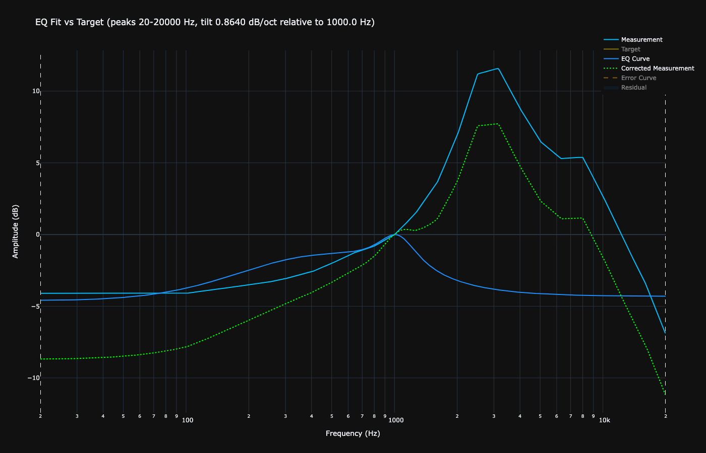
</div>

```
Preamp: 0.0 dB
Filter 1: ON PK Fc 20.00 Hz Gain -4.58 dB Q 0.100
Filter 2: ON PK Fc 1035.02 Hz Gain 2.50 dB Q 1.726
Filter 3: ON PK Fc 20000.00 Hz Gain -4.30 dB Q 0.016
```

Even the canonical neutral target carries a significant treble energy excess when judged against uniform power delivery. Any headphone tuned to DF spec inherits that skew. So does any headphone tuned to a target derived from it.

---

## What Energy-Balanced Means

Standard headphone EQ corrects the *shape* of the frequency response -- it nudges the measured curve toward a target curve in the dB domain. This is effective for tonal balance, but it optimizes the wrong thing if temporal fidelity matters.

A frequency response measurement describes a headphone's average gain at each frequency. It says nothing about how evenly the headphone distributes energy across the spectrum during real playback. When some frequency bands carry significantly more acoustic power than others, their decay tails physically overlap transients in quieter bands -- smearing detail that should be distinct. The result is a kind of soft congestion that persists even after good tonal correction, because tonal correction was never targeting it.

Energy-balanced EQ targets the problem directly. The goal is flat acoustic power per Hz across all time frames, not just a flat average gain curve.

## How the Profiles Are Generated

Each profile is produced by the following pipeline:

1. A white-noise reference signal is convolved with the inverse of the headphone's measured frequency response, producing a pre-distorted signal that models the headphone's coloration. The candidate EQ is then applied to this signal, with the goal of recovering the original white noise as closely as possible.
2. For each frame, the Power Spectral Density of the corrected signal is compared to the PSD of the reference frame, and the RMS deviation is computed.
3. This frame-wise energy RMSE is aggregated across the full recording as mean, P95, and max.
4. An optimizer searches for the smallest set of broad peaking IIR filters that minimizes mean frame-wise RMSE.

White noise is the natural target because it carries exactly equal energy per Hz by definition. Minimizing frame-wise PSD deviation against white noise is therefore equivalent to equalizing acoustic power delivery across frequency and time simultaneously.

The constraint to broad filters (low Q values) is not cosmetic. Narrow filters introduce pre-ringing and group delay artifacts that degrade temporal resolution even when they improve steady-state RMSE. Broad filters correct the overall energy tilt while leaving fine spectral structure intact.

## Why This Differs from Matching a Perceptual Target

Two EQs can produce nearly identical corrected frequency response curves on a graph while behaving very differently in the time domain.

A Harman or DF-corrected EQ is optimized to match a target shape over the long-term average. The frame-by-frame energy distribution is not part of that optimization, so systematic imbalances between bands can persist. Those imbalances are what create the subtle smearing, reduced transient definition, and unstable imaging that survive even well-executed tonal correction.

Energy-balanced EQ does not describe what the headphone should look like on a graph. It describes what the headphone should do with real audio in real time: deliver equal acoustic power at every frequency, in every moment.

The audible effects tend to show up as:

- Transients with clearly defined edges -- kick attacks, consonants, plucked string onsets
- A stereo image that stays stable as dynamics change
- Bass that stops when the note ends rather than accumulating between beats
- Treble that is present and detailed without fatigue, because excess high-frequency energy is brought in line with the rest of the spectrum

## How to Use These Profiles

These are parametric EQ profiles in the standard ParametricEQ.txt format, compatible with any software that accepts it. Common options:

- **Windows:** EqualizerAPO with the Peace GUI
- **macOS:** eqMac with the parametric EQ plugin
- **Android:** Wavelet (copy filter values into the parametric EQ section)
- **Linux:** EasyEffects

Copy the Preamp and Filter lines for your headphone into your EQ software. Set the preamp gain first -- it is required to avoid clipping.

## A Note on Listening Level

These profiles are calibrated against a physics-level target rather than a psychoacoustic preference model. At higher listening levels, where the ear's equal-loudness sensitivity naturally flattens, the result tends to feel tonally neutral in addition to being temporally clean. At lower volumes, bass and treble may feel slightly leaner than a Harman-tuned headphone. That is the physics of equal-loudness curves, not a flaw in the EQ.

---

## Reference Targets

The `targets` folder contains energy-balanced versions of three widely used perceptual targets: Diffuse-Field, Harman Over-Ear 2018, and Harman In-Ear 2019. These are the original curves after applying the same energy-balancing correction described above -- their spectral power delivery has been flattened to match white noise while preserving the underlying tonal shape.

They are provided for anyone who wants to use conventional dB-domain curve matching but with a physically corrected starting point. If you prefer the warmth of Harman or the leaner character of DF but still want flat energy delivery, these targets let you have both.

Also included is the PC1 Neutral Target -- a data-driven reference derived entirely from measurement. It is computed by extracting the first principal component from the ten open-back headphones in this repository with the lowest post-correction energy RMSE, then passing the result through the same energy-balancing pipeline. The PC1 captures the shared tonal structure of the most physically accurate headphones in the dataset, corrected to ensure flat power delivery in its own right.

<div align="center">
  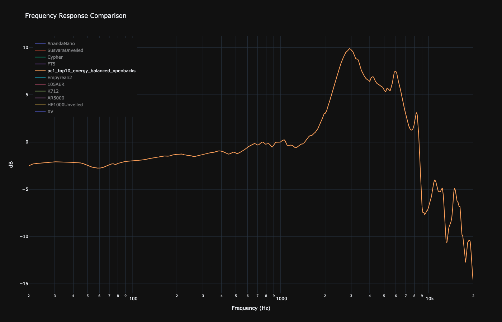
</div>

---

## Headphone EQ Profiles

<details>
  <summary><strong>ABYSS AB1266 TC</strong></summary>

  <div align="center">
    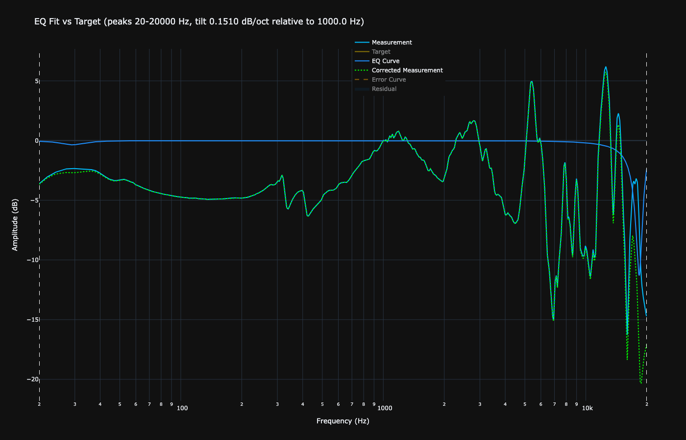
  </div>

```text
Preamp: 0.0 dB
Filter 1: ON PK Fc 29.10 Hz Gain -0.36 dB Q 3.000
Filter 2: ON PK Fc 18338.93 Hz Gain -11.30 dB Q 2.811
```

</details>

<details>
  <summary><strong>ADAM Audio H200</strong></summary>

  <div align="center">
    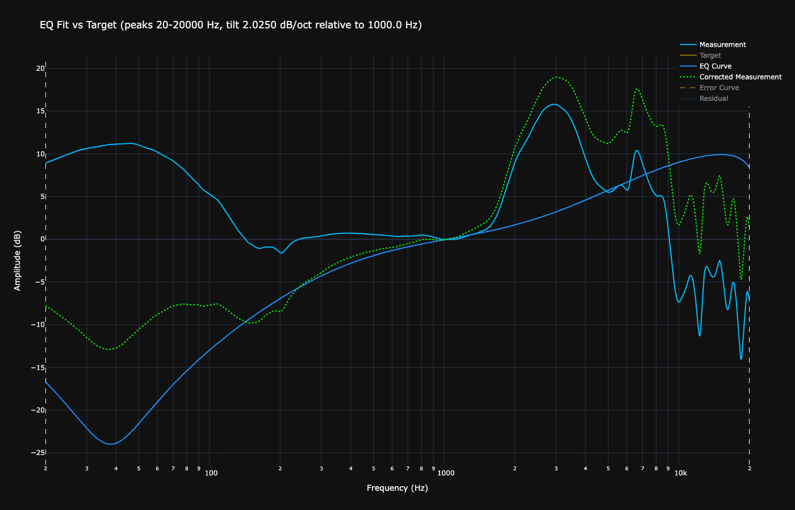
  </div>

```text
Preamp: -9.9 dB
Filter 1: ON PK Fc 37.92 Hz Gain -24.00 dB Q 0.390
Filter 2: ON PK Fc 15107.49 Hz Gain 9.93 dB Q 0.196
```

</details>

<details>
  <summary><strong>AKG K361</strong></summary>

  <div align="center">
    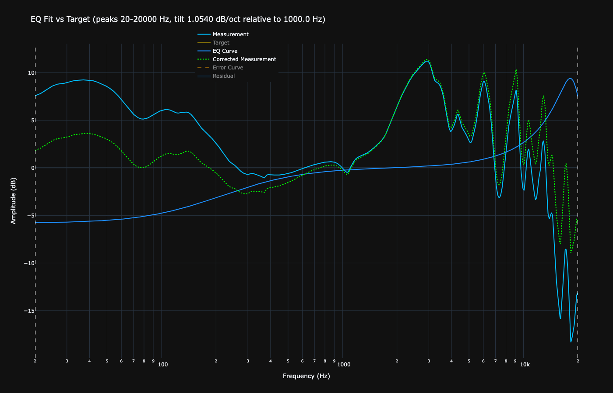
  </div>

```text
Preamp: -9.4 dB
Filter 1: ON PK Fc 20.00 Hz Gain -5.74 dB Q 0.092
Filter 2: ON PK Fc 18123.73 Hz Gain 9.40 dB Q 0.570
```

</details>

<details>
  <summary><strong>AKG K612 PRO</strong></summary>

  <div align="center">
    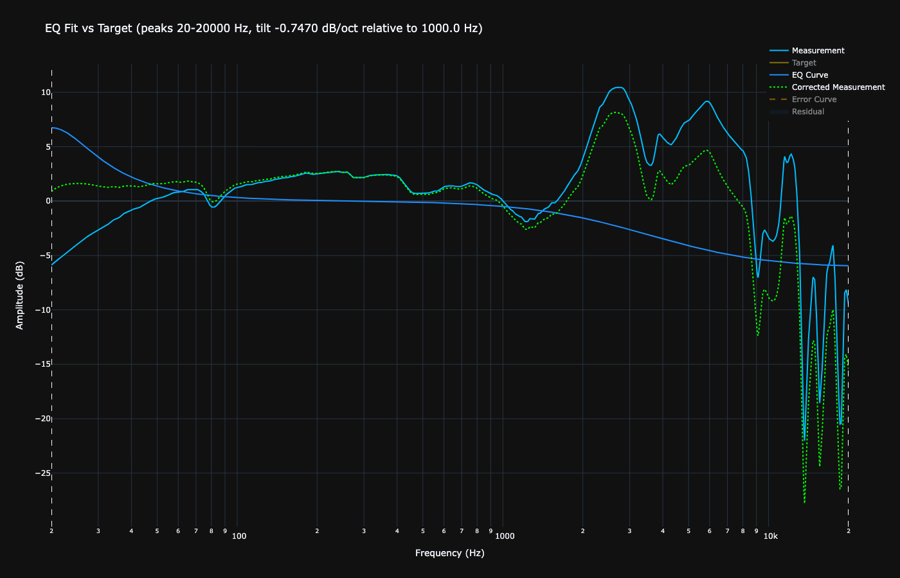
  </div>

```text
Preamp: -6.7 dB
Filter 1: ON PK Fc 20.00 Hz Gain 6.75 dB Q 0.971
Filter 2: ON PK Fc 19999.97 Hz Gain -5.94 dB Q 0.060
```

</details>

<details>
  <summary><strong>AKG K702</strong></summary>

  <div align="center">
    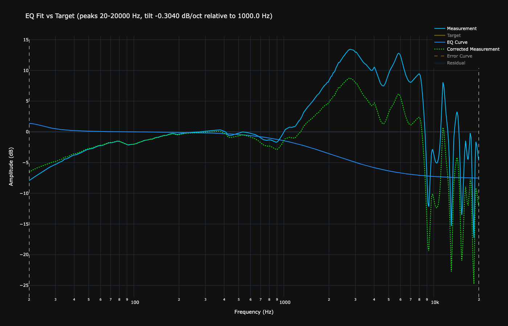
  </div>

```text
Preamp: -1.4 dB
Filter 1: ON PK Fc 20.00 Hz Gain 1.37 dB Q 1.574
Filter 2: ON PK Fc 20000.00 Hz Gain -7.52 dB Q 0.037
```

</details>

<details>
  <summary><strong>AKG K712 PRO</strong></summary>

  <div align="center">
    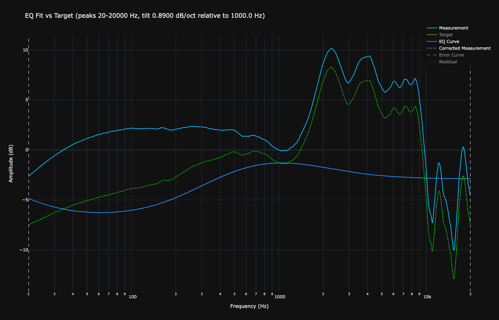
  </div>

```text
Preamp: 1.3 dB
Filter 1: ON PK Fc 61.86 Hz Gain -6.27 dB Q 0.190
Filter 2: ON PK Fc 19995.38 Hz Gain -2.87 dB Q 0.032
```

</details>

<details>
  <summary><strong>AKG K812</strong></summary>

  <div align="center">
    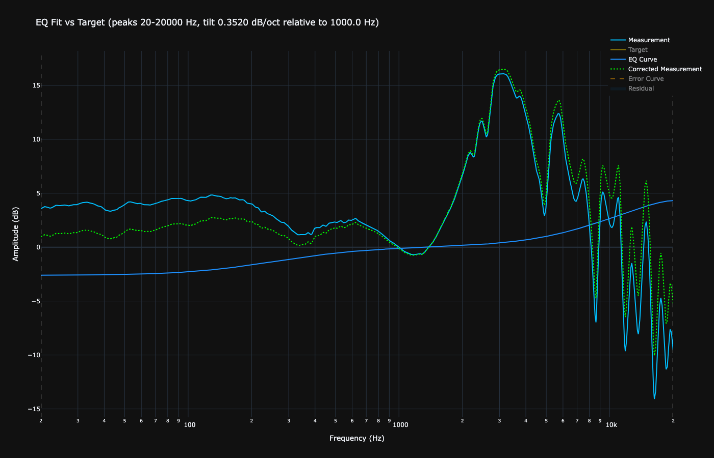
  </div>

```text
Preamp: -4.3 dB
Filter 1: ON PK Fc 20.00 Hz Gain -2.60 dB Q 0.077
Filter 2: ON PK Fc 20000.00 Hz Gain 4.31 dB Q 0.168
```

</details>

<details>
  <summary><strong>Audeze LCD-2 Closed-Back</strong></summary>

  <div align="center">
    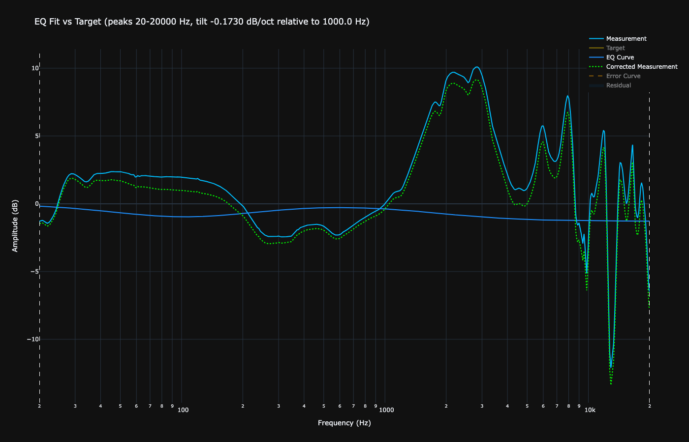
  </div>

```text
Preamp: 0.2 dB
Filter 1: ON PK Fc 102.67 Hz Gain -0.96 dB Q 0.424
Filter 2: ON PK Fc 19997.48 Hz Gain -1.28 dB Q 0.030
```

</details>

<details>
  <summary><strong>Audeze LCD-S20</strong></summary>

  <div align="center">
    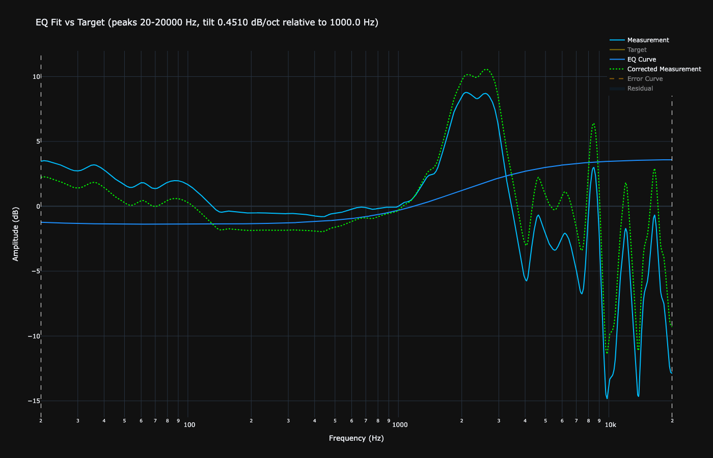
  </div>

```text
Preamp: -3.6 dB
Filter 1: ON PK Fc 120.46 Hz Gain -1.39 dB Q 0.061
Filter 2: ON PK Fc 19635.72 Hz Gain 3.59 dB Q 0.036
```

</details>

<details>
  <summary><strong>Audeze LCD-X</strong></summary>

  <div align="center">
    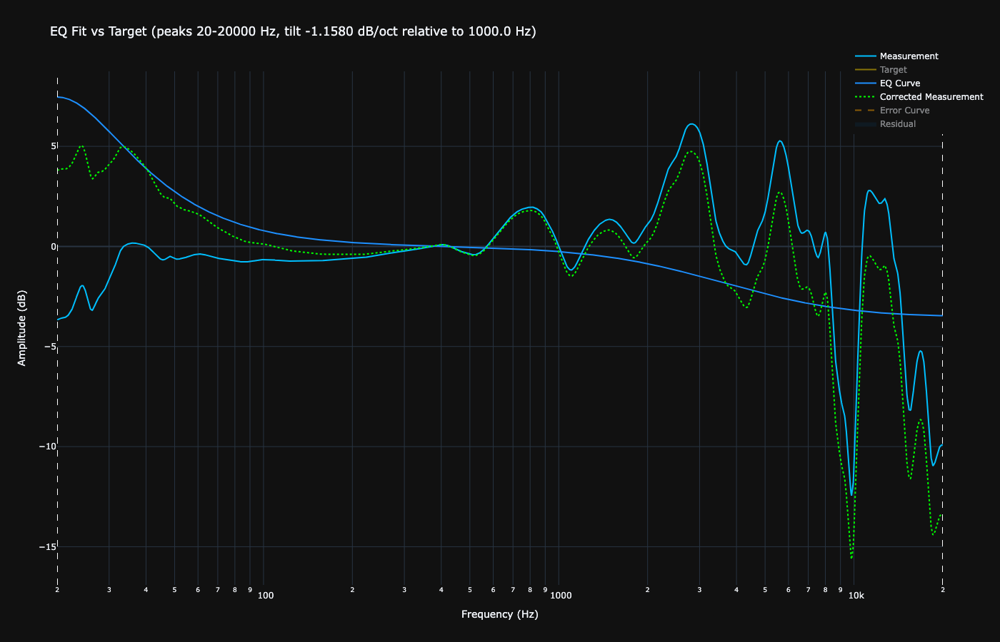
  </div>

```text
Preamp: -7.5 dB
Filter 1: ON PK Fc 20.00 Hz Gain 7.46 dB Q 0.636
Filter 2: ON PK Fc 20000.00 Hz Gain -3.46 dB Q 0.061
```

</details>

<details>
  <summary><strong>Audeze LCD-XC</strong></summary>

  <div align="center">
    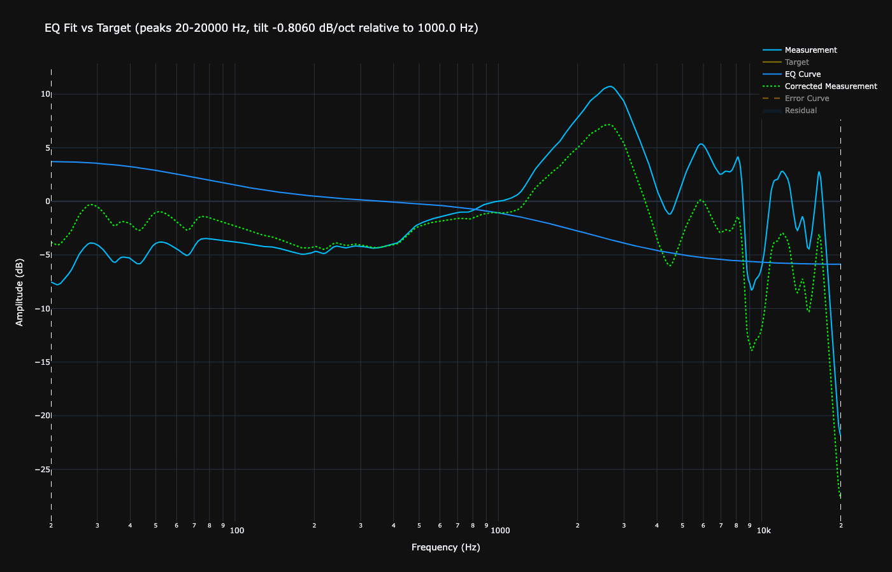
  </div>

```text
Preamp: -3.7 dB
Filter 1: ON PK Fc 20.00 Hz Gain 3.71 dB Q 0.250
Filter 2: ON PK Fc 20000.00 Hz Gain -5.88 dB Q 0.037
```

</details>

<details>
  <summary><strong>Audeze MM-100</strong></summary>

  <div align="center">
    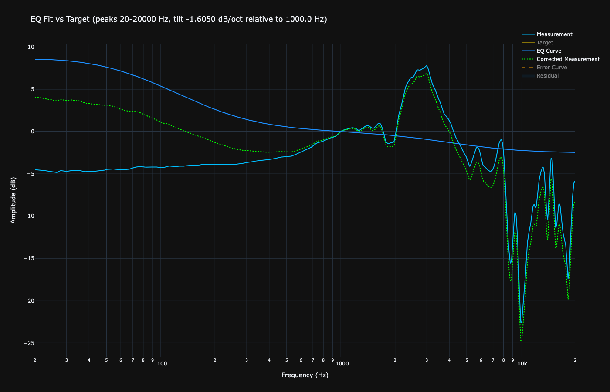
  </div>

```text
Preamp: -8.6 dB
Filter 1: ON PK Fc 20.00 Hz Gain 8.55 dB Q 0.157
Filter 2: ON PK Fc 20000.00 Hz Gain -2.47 dB Q 0.068
```

</details>

<details>
  <summary><strong>Audeze MM-500</strong></summary>

  <div align="center">
    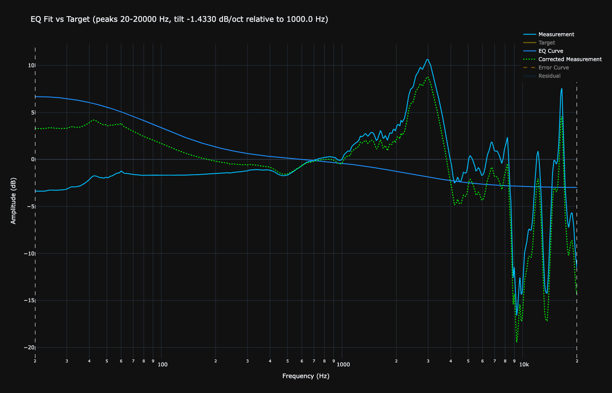
  </div>

```text
Preamp: -6.7 dB
Filter 1: ON PK Fc 20.00 Hz Gain 6.68 dB Q 0.207
Filter 2: ON PK Fc 20000.00 Hz Gain -2.98 dB Q 0.040
```

</details>

<details>
  <summary><strong>Audio-Technica ATH-ADX7000</strong></summary>

  <div align="center">
    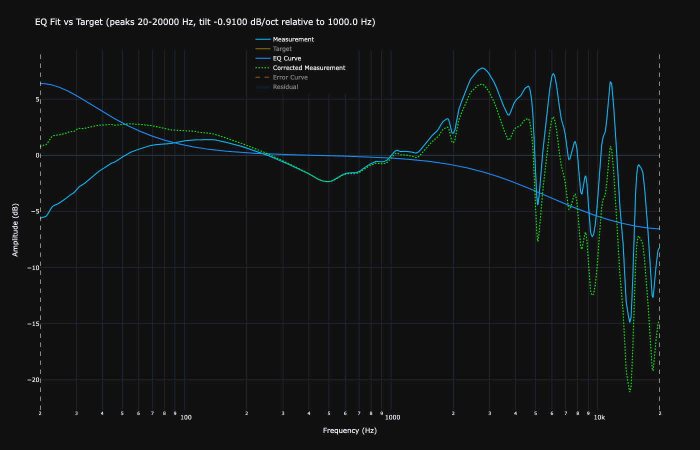
  </div>

```text
Preamp: -6.4 dB
Filter 1: ON PK Fc 20.00 Hz Gain 6.42 dB Q 0.525
Filter 2: ON PK Fc 20000.00 Hz Gain -6.54 dB Q 0.094
```

</details>

<details>
  <summary><strong>Audio-Technica ATH-M40x</strong></summary>

  <div align="center">
    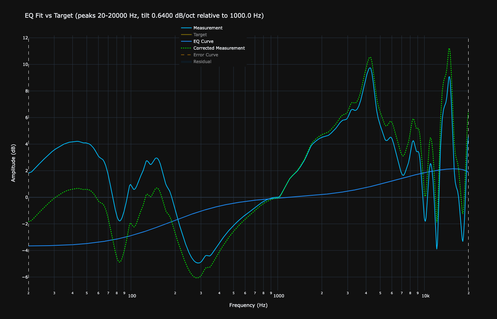
  </div>

```text
Preamp: -2.1 dB
Filter 1: ON PK Fc 20.00 Hz Gain -3.66 dB Q 0.107
Filter 2: ON PK Fc 15961.98 Hz Gain 2.14 dB Q 0.220
```

</details>

<details>
  <summary><strong>Audio-Technica ATH-M50x</strong></summary>

  <div align="center">
    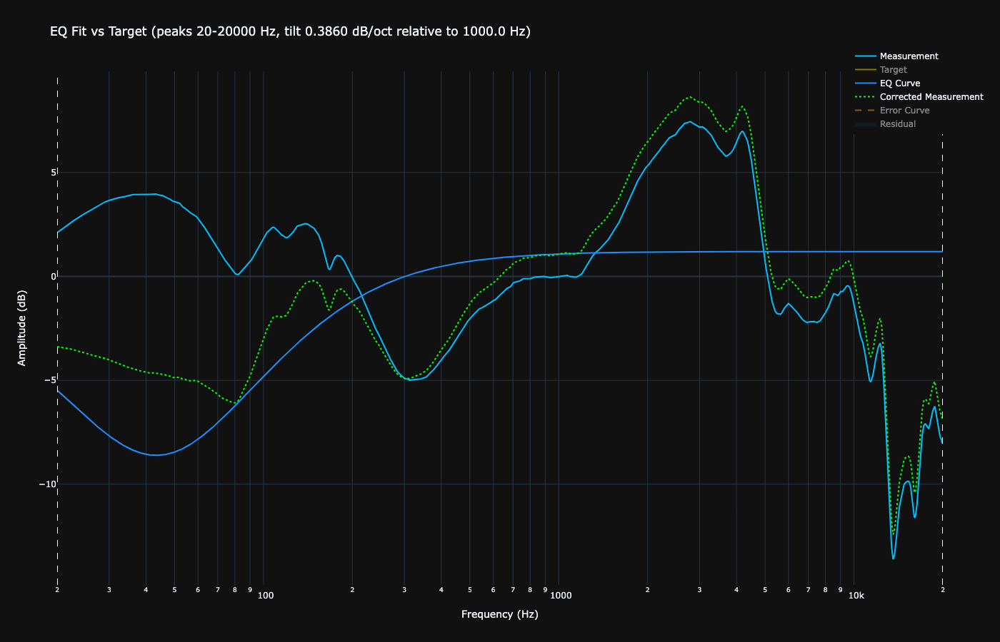
  </div>

```text
Preamp: -1.2 dB
Filter 1: ON PK Fc 44.24 Hz Gain -8.79 dB Q 0.428
Filter 2: ON PK Fc 7264.70 Hz Gain 1.20 dB Q 0.013
```

</details>

<details>
  <summary><strong>Audio-Technica ATH-R70x</strong></summary>

  <div align="center">
    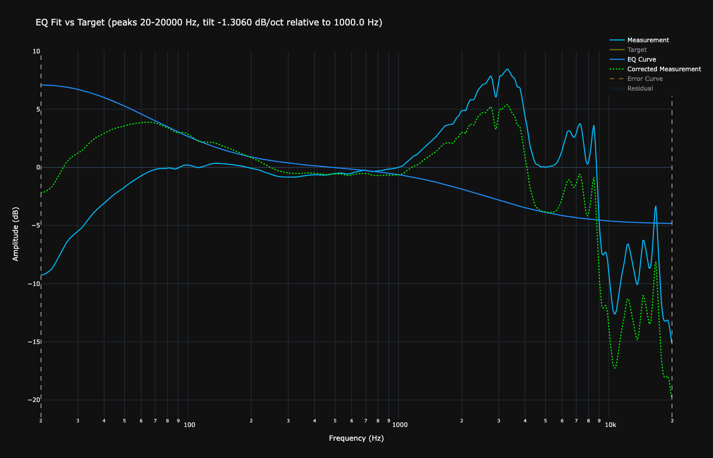
  </div>

```text
Preamp: -7.1 dB
Filter 1: ON PK Fc 20.00 Hz Gain 7.08 dB Q 0.272
Filter 2: ON PK Fc 20000.00 Hz Gain -4.82 dB Q 0.044
```

</details>

<details>
  <summary><strong>AUNE Audio AR5000</strong></summary>

  <div align="center">
    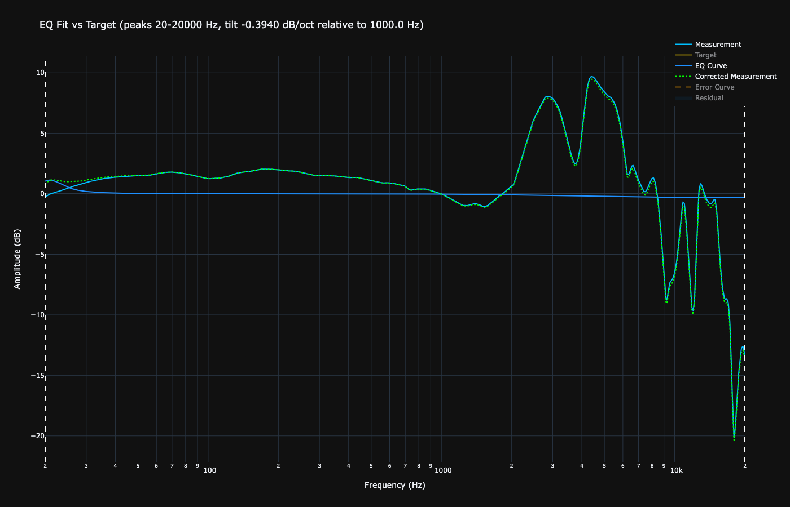
  </div>

```text
Preamp: -1.1 dB
Filter 1: ON PK Fc 21.00 Hz Gain 1.13 dB Q 2.999
Filter 2: ON PK Fc 18412.59 Hz Gain -0.31 dB Q 0.079
```

</details>

<details>
  <summary><strong>AUNE Audio SR7000</strong></summary>

  <div align="center">
    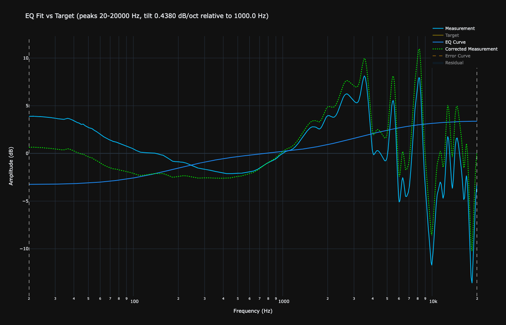
  </div>

```text
Preamp: -3.4 dB
Filter 1: ON PK Fc 20.63 Hz Gain -3.25 dB Q 0.109
Filter 2: ON PK Fc 19363.88 Hz Gain 3.37 dB Q 0.066
```

</details>

<details>
  <summary><strong>Beyerdynamic DT 1770 Pro</strong></summary>

  <div align="center">
    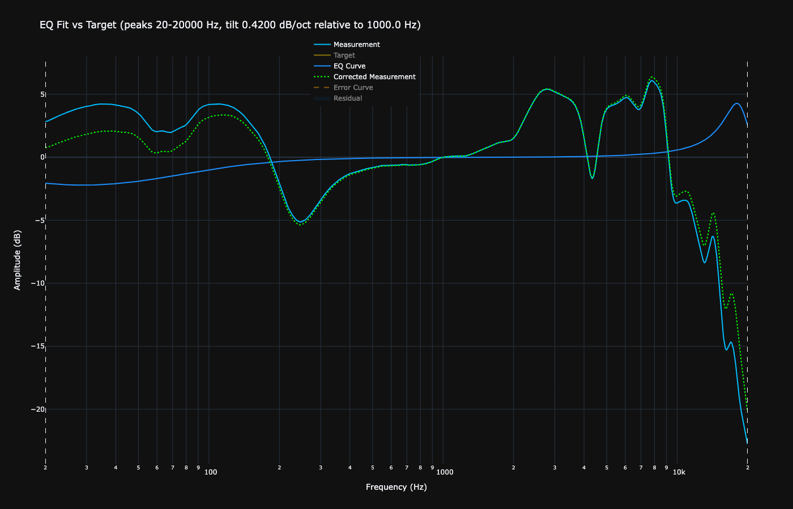
  </div>

```text
Preamp: -4.3 dB
Filter 1: ON PK Fc 29.04 Hz Gain -2.21 dB Q 0.350
Filter 2: ON PK Fc 17989.16 Hz Gain 4.28 dB Q 0.916
```

</details>

<details>
  <summary><strong>Beyerdynamic DT 270 Pro</strong></summary>

  <div align="center">
    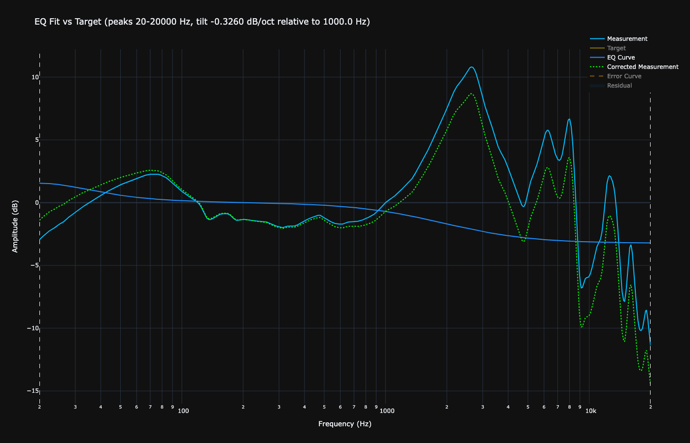
  </div>

```text
Preamp: -1.5 dB
Filter 1: ON PK Fc 20.00 Hz Gain 1.55 dB Q 0.608
Filter 2: ON PK Fc 20000.00 Hz Gain -3.21 dB Q 0.033
```

</details>

<details>
  <summary><strong>Beyerdynamic DT 700 Pro X</strong></summary>

  <div align="center">
    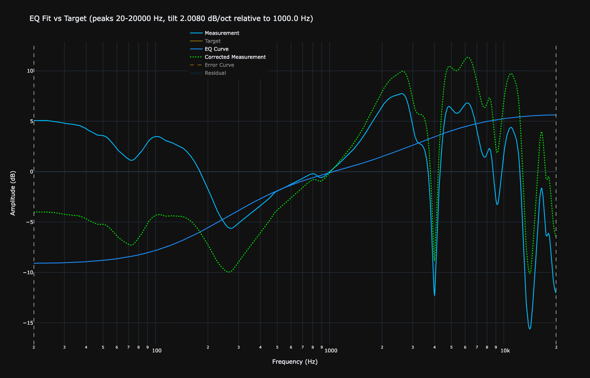
  </div>

```text
Preamp: -5.6 dB
Filter 1: ON PK Fc 20.00 Hz Gain -9.09 dB Q 0.078
Filter 2: ON PK Fc 19527.42 Hz Gain 5.63 dB Q 0.062
```

</details>

<details>
  <summary><strong>Beyerdynamic DT 770 Pro (32 ohm)</strong></summary>

  <div align="center">
    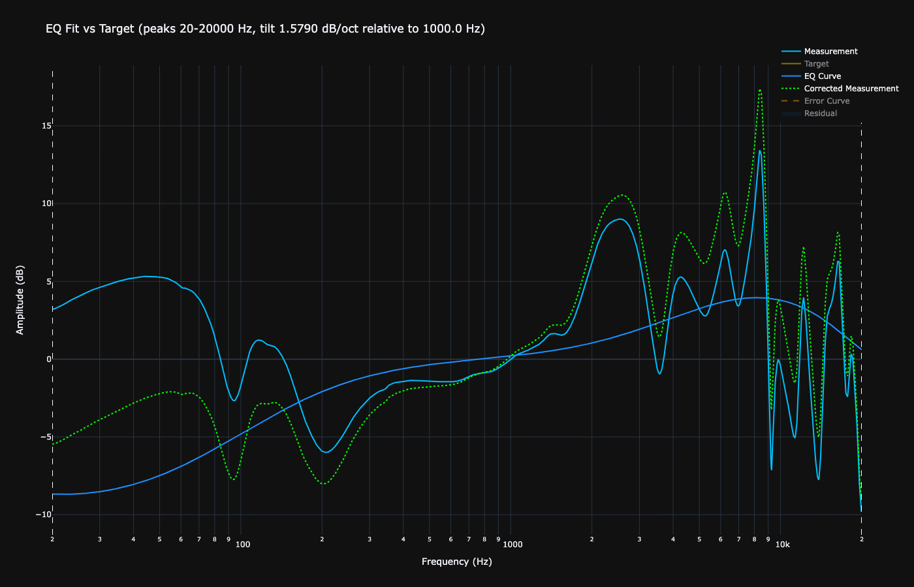
  </div>

```text
Preamp: -4.0 dB
Filter 1: ON PK Fc 21.97 Hz Gain -8.69 dB Q 0.205
Filter 2: ON PK Fc 8163.63 Hz Gain 3.95 dB Q 0.388
```

</details>

<details>
  <summary><strong>Beyerdynamic MMX 300 (2nd Gen)</strong></summary>

  <div align="center">
    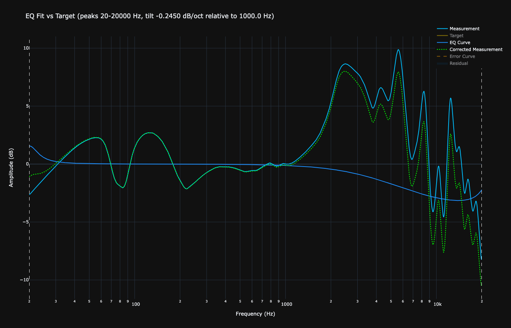
  </div>

```text
Preamp: 0.0 dB
Filter 1: ON PK Fc 19931.98 Hz Gain 2.70 dB Q 3.000
Filter 2: ON PK Fc 20000.00 Hz Gain -3.41 dB Q 0.091
```

</details>

<details>
  <summary><strong>Dan Clark Audio Aeon 2 Closed</strong></summary>

  <div align="center">
    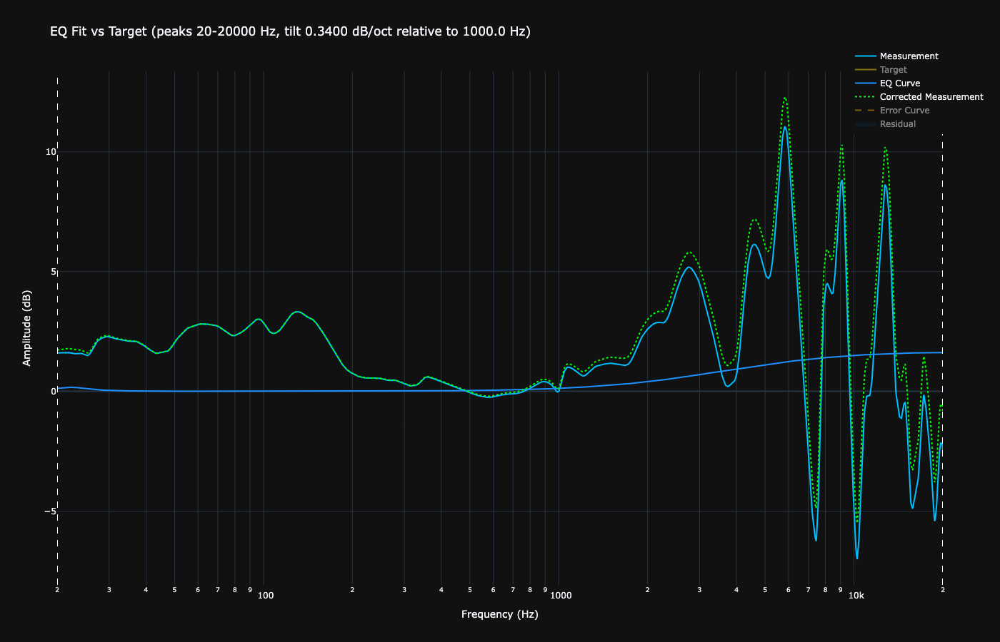
  </div>

```text
Preamp: -1.6 dB
Filter 1: ON PK Fc 22.27 Hz Gain 0.17 dB Q 2.996
Filter 2: ON PK Fc 19579.26 Hz Gain 1.62 dB Q 0.068
```

</details>

<details>
  <summary><strong>Dan Clark Audio Noire X</strong></summary>

  <div align="center">
    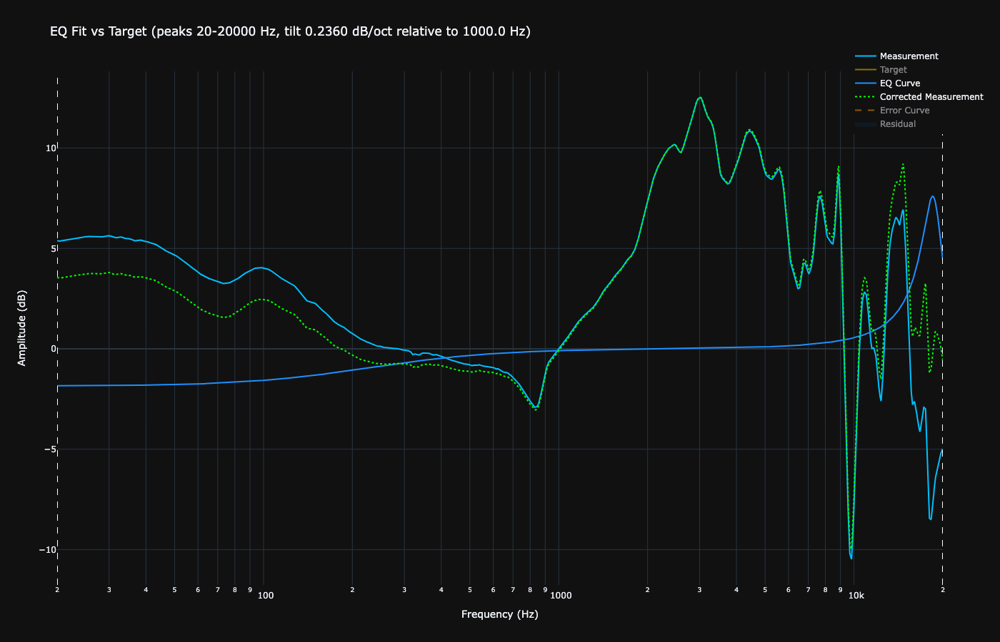
  </div>

```text
Preamp: -7.6 dB
Filter 1: ON PK Fc 20.00 Hz Gain -1.84 dB Q 0.086
Filter 2: ON PK Fc 18473.63 Hz Gain 7.60 dB Q 1.193
```

</details>

<details>
  <summary><strong>DUNU Arashi</strong></summary>

  <div align="center">
    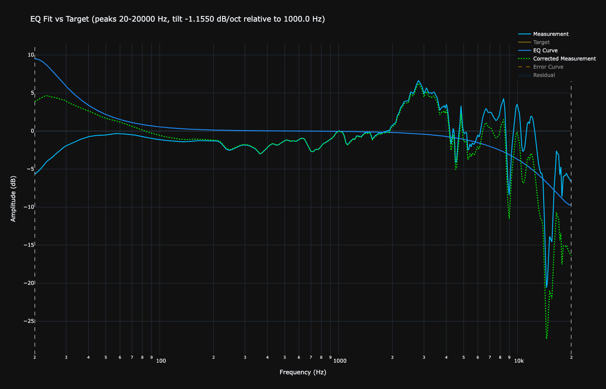
  </div>

```text
Preamp: -9.5 dB
Filter 1: ON PK Fc 20.00 Hz Gain 9.50 dB Q 0.919
Filter 2: ON PK Fc 20000.00 Hz Gain -9.74 dB Q 0.280
```

</details>

<details>
  <summary><strong>Drop + grell OAE1</strong></summary>

  <div align="center">
    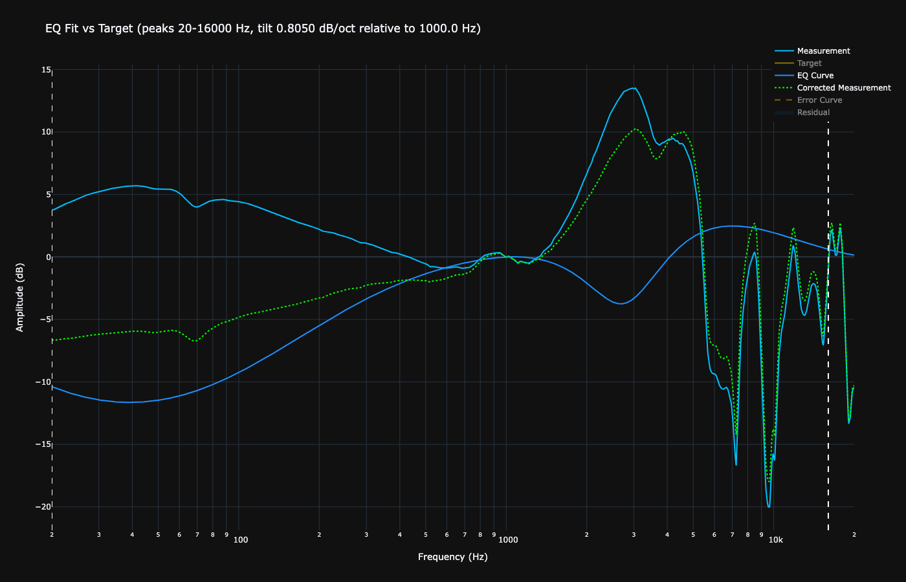
  </div>

```text
Preamp: 0.7 dB
Filter 1: ON PK Fc 41.18 Hz Gain -13.92 dB Q 0.469
Filter 2: ON PK Fc 215.74 Hz Gain -3.43 dB Q 1.490
Filter 3: ON PK Fc 8757.31 Hz Gain -2.86 dB Q 0.232
```

</details>

<details>
  <summary><strong>FIIO FT1</strong></summary>

  <div align="center">
    
  </div>

```text
Preamp: -7.7 dB
Filter 1: ON PK Fc 33.94 Hz Gain -12.13 dB Q 0.319
Filter 2: ON PK Fc 20000.00 Hz Gain 7.74 dB Q 0.052
```

</details>

<details>
  <summary><strong>FIIO FT1 Pro</strong></summary>

  <div align="center">
    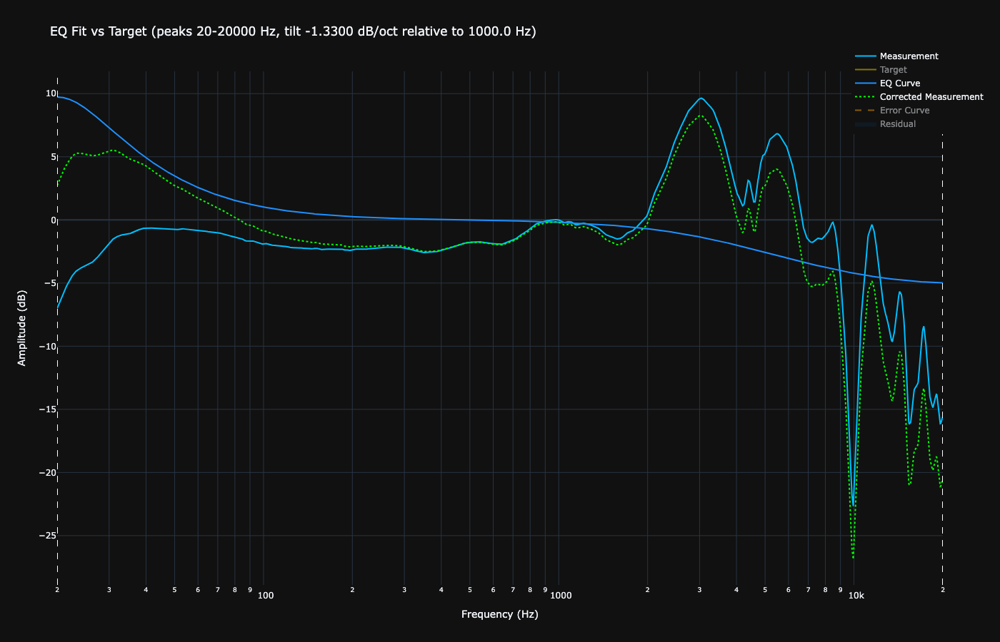
  </div>

```text
Preamp: -9.7 dB
Filter 1: ON PK Fc 20.00 Hz Gain 9.73 dB Q 0.658
Filter 2: ON PK Fc 20000.00 Hz Gain -4.98 dB Q 0.089
```

</details>

<details>
  <summary><strong>FIIO FT5 (Suede Pads)</strong></summary>

  <div align="center">
    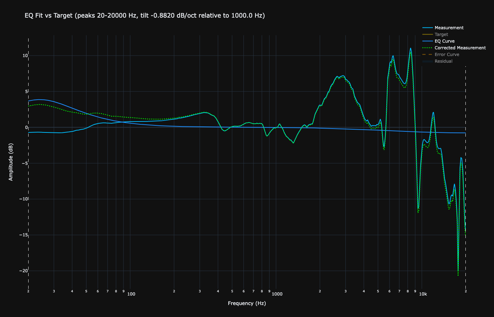
  </div>

```text
Preamp: -3.9 dB
Filter 1: ON PK Fc 24.00 Hz Gain 3.87 dB Q 0.619
Filter 2: ON PK Fc 20000.00 Hz Gain -0.78 dB Q 0.090
```

</details>

<details>
  <summary><strong>FIIO FT7</strong></summary>

  <div align="center">
    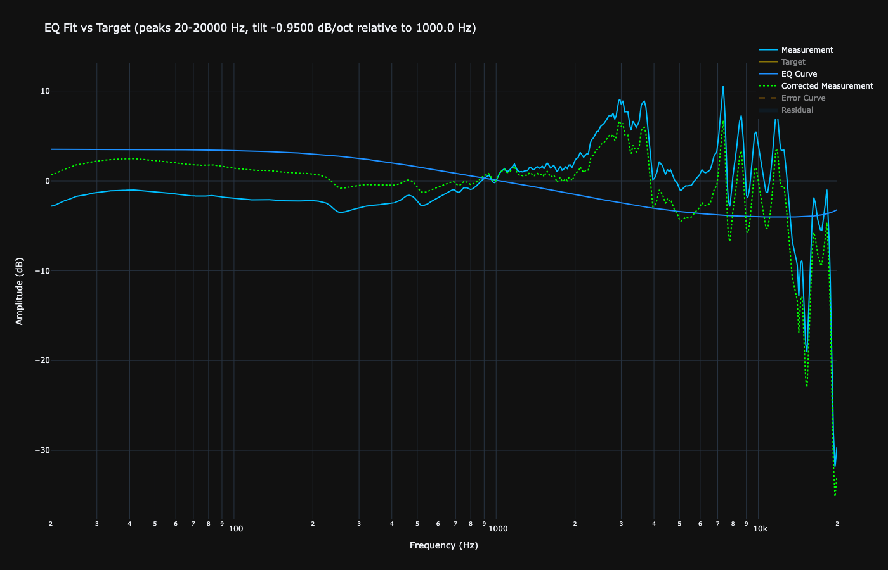
  </div>

```text
Preamp: -3.5 dB
Filter 1: ON PK Fc 20.00 Hz Gain 3.51 dB Q 0.041
Filter 2: ON PK Fc 12203.03 Hz Gain -4.04 dB Q 0.152
```

</details>

<details>
  <summary><strong>FIIO FT13</strong></summary>

  <div align="center">
    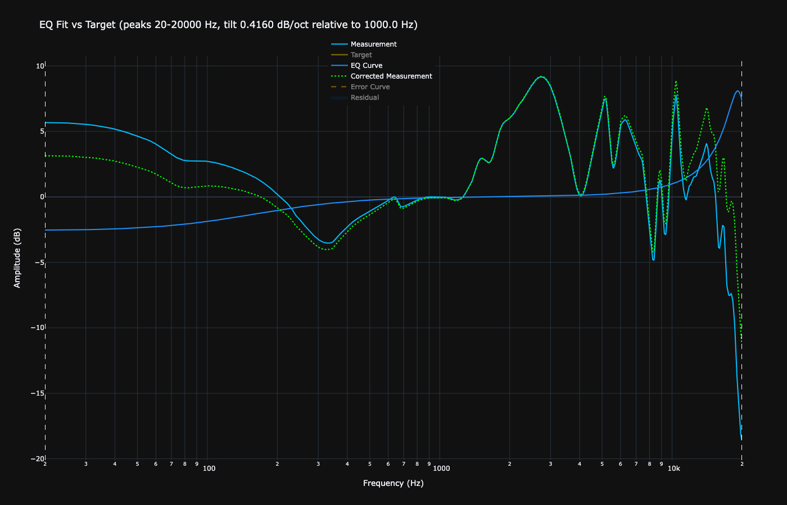
  </div>

```text
Preamp: -8.1 dB
Filter 1: ON PK Fc 20.01 Hz Gain -2.53 dB Q 0.123
Filter 2: ON PK Fc 19161.82 Hz Gain 8.10 dB Q 0.757
```

</details>

<details>
  <summary><strong>FIIO JT1</strong></summary>

  <div align="center">
    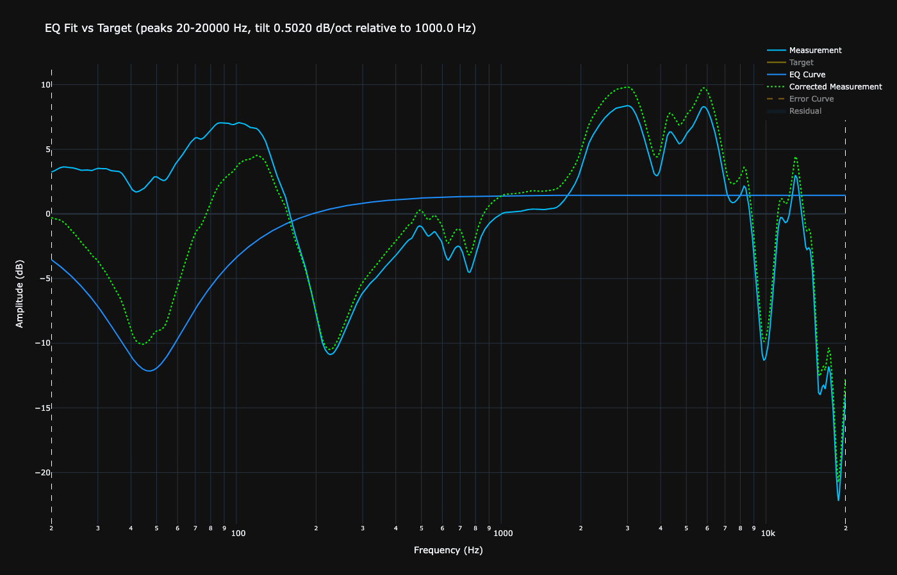
  </div>

```text
Preamp: -1.5 dB
Filter 1: ON PK Fc 47.14 Hz Gain -12.70 dB Q 0.872
Filter 2: ON PK Fc 5746.85 Hz Gain 1.45 dB Q 0.010
```

</details>

<details>
  <summary><strong>FIIO JT7</strong></summary>

  <div align="center">
    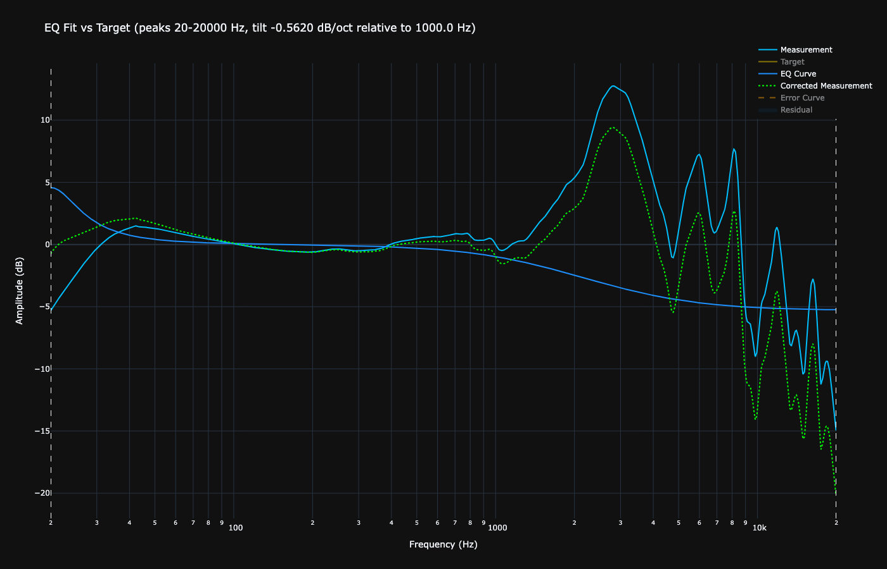
  </div>

```text
Preamp: -4.6 dB
Filter 1: ON PK Fc 20.00 Hz Gain 4.58 dB Q 1.533
Filter 2: ON PK Fc 20000.00 Hz Gain -5.24 dB Q 0.037
```

</details>

<details>
  <summary><strong>Focal Clear</strong></summary>

  <div align="center">
    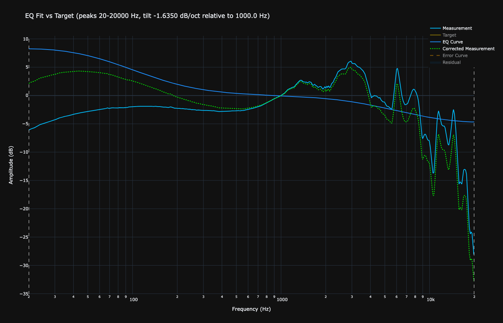
  </div>

```text
Preamp: -8.2 dB
Filter 1: ON PK Fc 20.00 Hz Gain 8.25 dB Q 0.187
Filter 2: ON PK Fc 19999.91 Hz Gain -4.67 dB Q 0.096
```

</details>

<details>
  <summary><strong>Focal Clear Professional</strong></summary>

  <div align="center">
    
  </div>

```text
Preamp: -7.0 dB
Filter 1: ON PK Fc 20.00 Hz Gain 7.04 dB Q 0.217
Filter 2: ON PK Fc 20000.00 Hz Gain -4.12 dB Q 0.052
```

</details>

<details>
  <summary><strong>Focal Elex</strong></summary>

  <div align="center">
    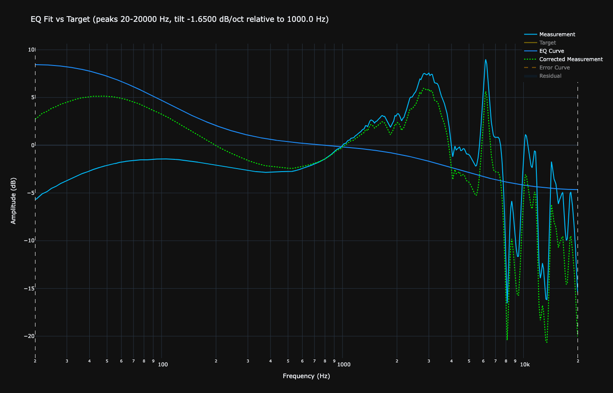
  </div>

```text
Preamp: -8.4 dB
Filter 1: ON PK Fc 20.00 Hz Gain 8.44 dB Q 0.184
Filter 2: ON PK Fc 20000.00 Hz Gain -4.65 dB Q 0.071
```

</details>

<details>
  <summary><strong>Focal Utopia</strong></summary>

  <div align="center">
    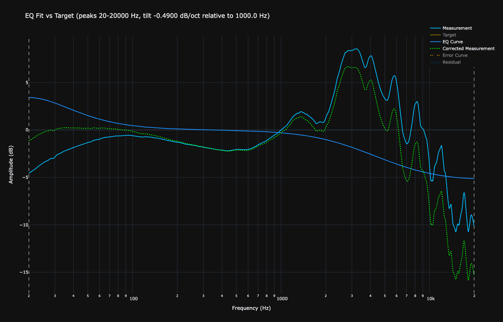
  </div>

```text
Preamp: -3.4 dB
Filter 1: ON PK Fc 20.00 Hz Gain 3.42 dB Q 0.534
Filter 2: ON PK Fc 20000.00 Hz Gain -5.13 dB Q 0.072
```

</details>

<details>
  <summary><strong>Fostex T50RP mk4</strong></summary>

  <div align="center">
    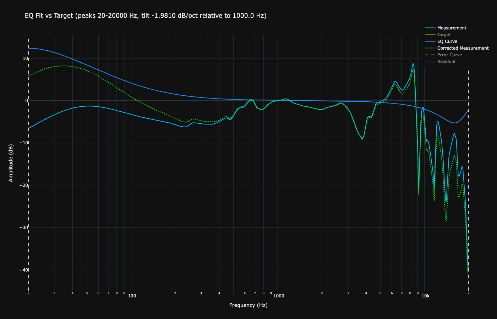
  </div>

```text
Preamp: -12.4 dB
Filter 1: ON PK Fc 20.00 Hz Gain 12.37 dB Q 0.310
Filter 2: ON PK Fc 15985.75 Hz Gain -5.30 dB Q 0.708
```

</details>

<details>
  <summary><strong>grell OAE2</strong></summary>

  <div align="center">
    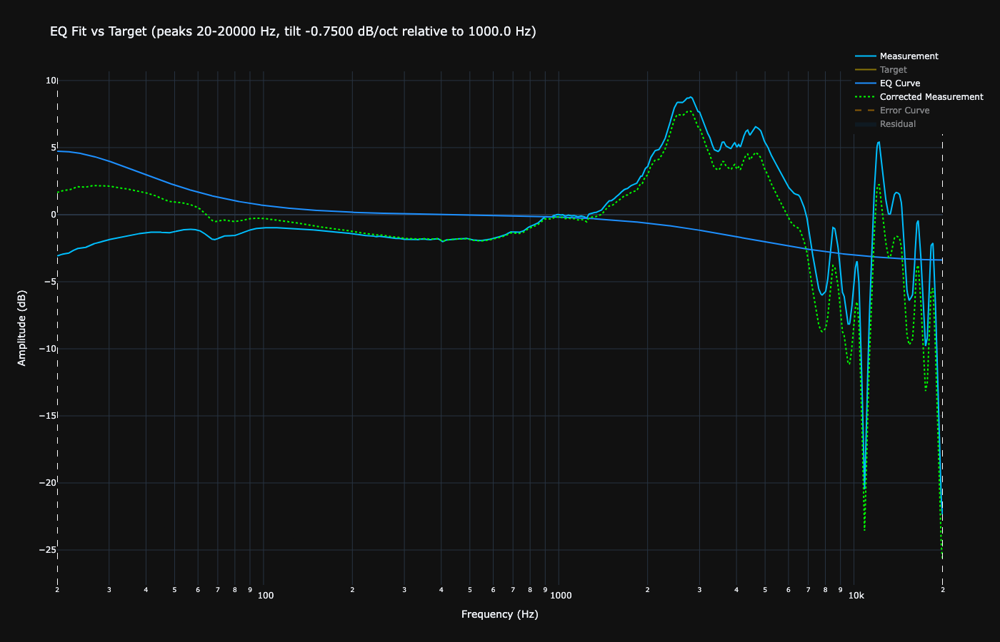
  </div>

```text
Preamp: -4.7 dB
Filter 1: ON PK Fc 20.00 Hz Gain 4.73 dB Q 0.511
Filter 2: ON PK Fc 20000.00 Hz Gain -3.38 dB Q 0.074
```

</details>

<details>
  <summary><strong>HarmonicDyne Poseidon</strong></summary>

  <div align="center">
    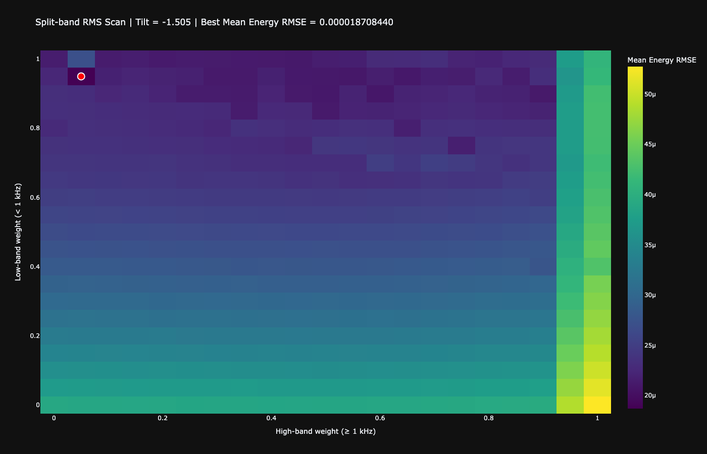
  </div>

```text
Preamp: -10.5 dB
Filter 1: ON PK Fc 20.00 Hz Gain 9.92 dB Q 0.524
Filter 2: ON PK Fc 732.17 Hz Gain 3.06 dB Q 0.059
Filter 3: ON PK Fc 19830.81 Hz Gain -5.60 dB Q 0.016
```

</details>

<details>
  <summary><strong>HarmonicDyne Romantic</strong></summary>

  <div align="center">
    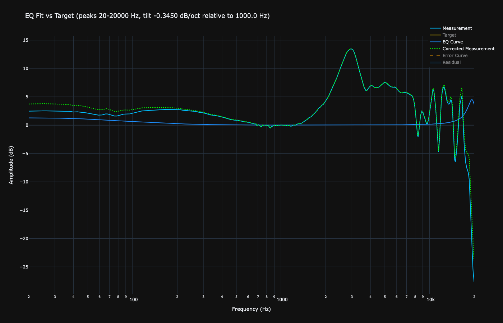
  </div>

```text
Preamp: -4.5 dB
Filter 1: ON PK Fc 20.76 Hz Gain 1.27 dB Q 0.215
Filter 2: ON PK Fc 19265.12 Hz Gain 4.50 dB Q 1.378
```

</details>

<details>
  <summary><strong>HarmonicDyne x Z Reviews Eris</strong></summary>

  <div align="center">
    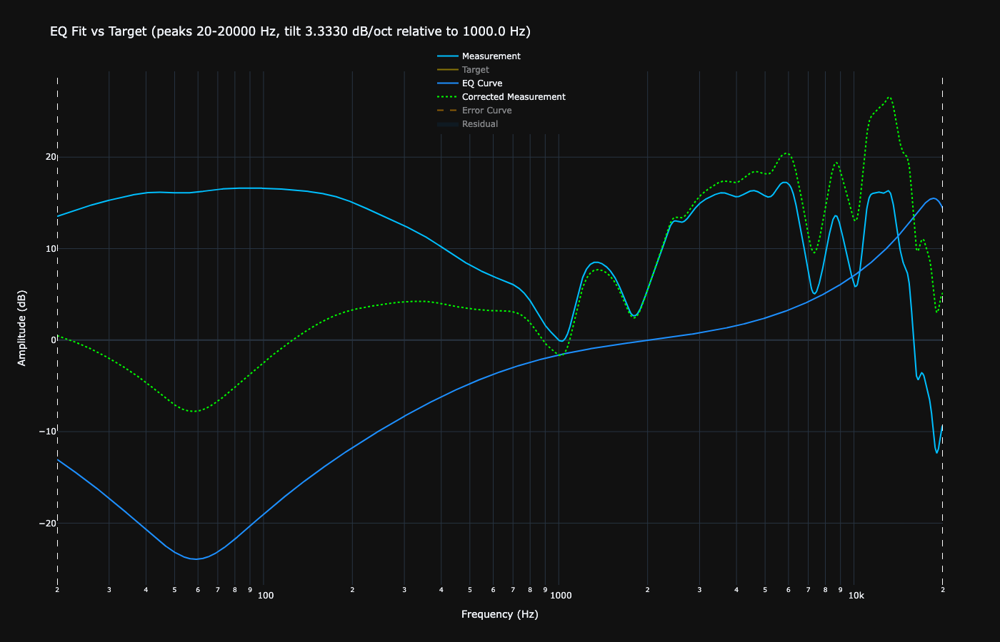
  </div>

```text
Preamp: -15.5 dB
Filter 1: ON PK Fc 59.03 Hz Gain -23.95 dB Q 0.333
Filter 2: ON PK Fc 18579.03 Hz Gain 15.50 dB Q 0.345
```

</details>

<details>
  <summary><strong>HEDD Audio HEDDphone D1</strong></summary>

  <div align="center">
    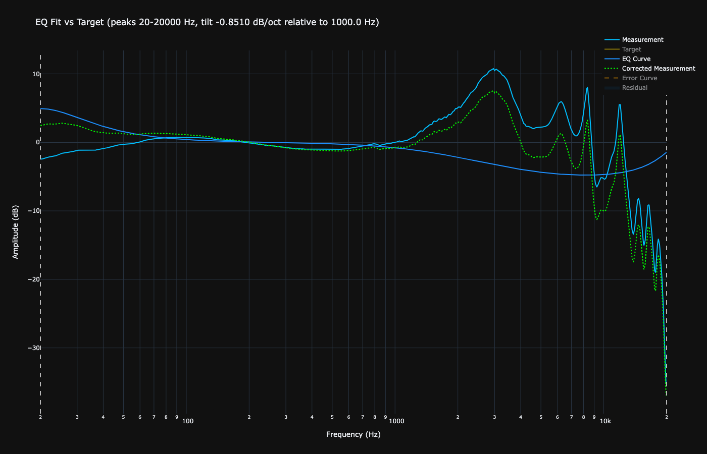
  </div>

```text
Preamp: -4.9 dB
Filter 1: ON PK Fc 20.00 Hz Gain 4.92 dB Q 0.705
Filter 2: ON PK Fc 8242.75 Hz Gain -4.78 dB Q 0.254
```

</details>

<details>
  <summary><strong>HEDD Audio HEDDphone TWO</strong></summary>

  <div align="center">
    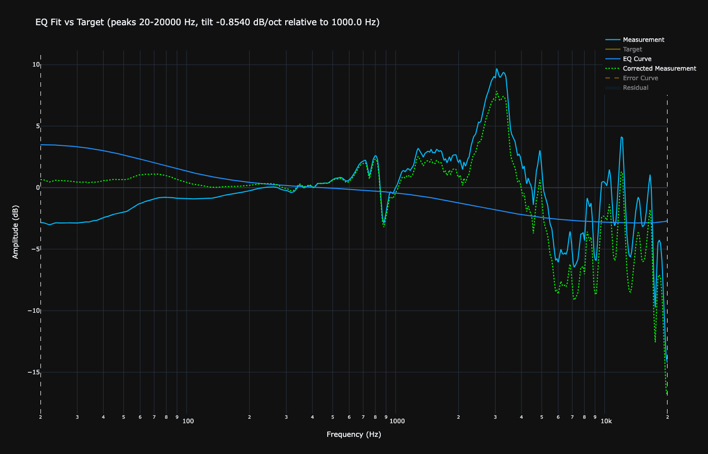
  </div>

```text
Preamp: -3.5 dB
Filter 1: ON PK Fc 20.00 Hz Gain 3.49 dB Q 0.265
Filter 2: ON PK Fc 14548.08 Hz Gain -2.87 dB Q 0.109
```

</details>

<details>
  <summary><strong>HEDD Audio HEDDphone TWO GT</strong></summary>

  <div align="center">
    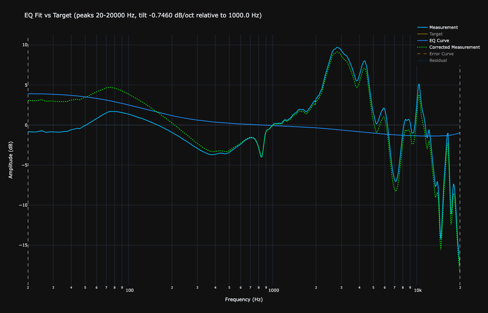
  </div>

```text
Preamp: -3.9 dB
Filter 1: ON PK Fc 20.00 Hz Gain 3.91 dB Q 0.155
Filter 2: ON PK Fc 12458.11 Hz Gain -1.38 dB Q 0.211
```

</details>

<details>
  <summary><strong>HIFIMAN Ananda Nano</strong></summary>

  <div align="center">
    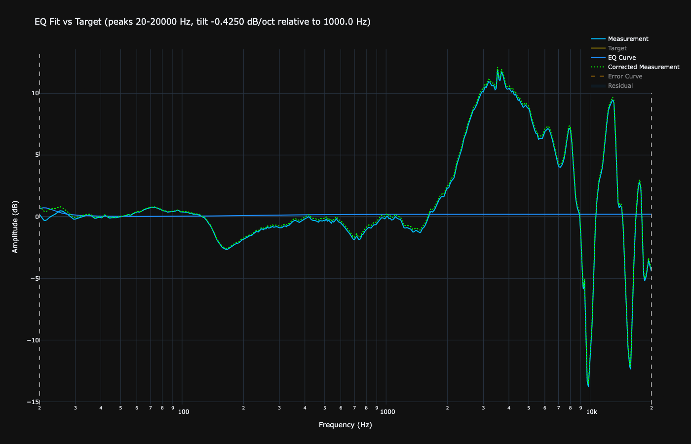
  </div>

```text
Preamp: -0.7 dB
Filter 1: ON PK Fc 21.05 Hz Gain 0.72 dB Q 3.000
Filter 2: ON PK Fc 12053.32 Hz Gain 0.21 dB Q 0.015
```

</details>

<details>
  <summary><strong>HIFIMAN Ananda Unveiled</strong></summary>

  <div align="center">
    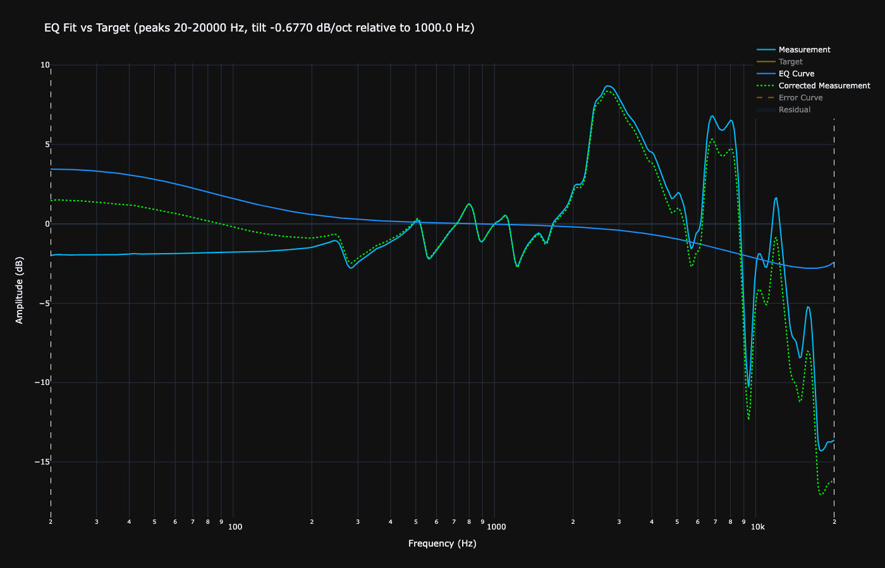
  </div>

```text
Preamp: -3.4 dB
Filter 1: ON PK Fc 20.00 Hz Gain 3.45 dB Q 0.226
Filter 2: ON PK Fc 16416.76 Hz Gain -2.80 dB Q 0.265
```

</details>

<details>
  <summary><strong>HIFIMAN Arya Organic</strong></summary>

  <div align="center">
    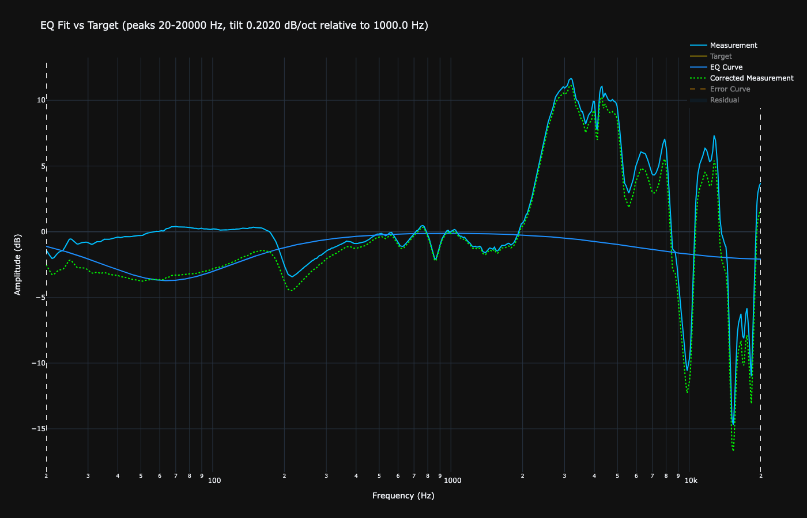
  </div>

```text
Preamp: 0.1 dB
Filter 1: ON PK Fc 64.68 Hz Gain -3.72 dB Q 0.525
Filter 2: ON PK Fc 20000.00 Hz Gain -2.08 dB Q 0.098
```

</details>

<details>
  <summary><strong>HIFIMAN Arya Unveiled</strong></summary>

  <div align="center">
    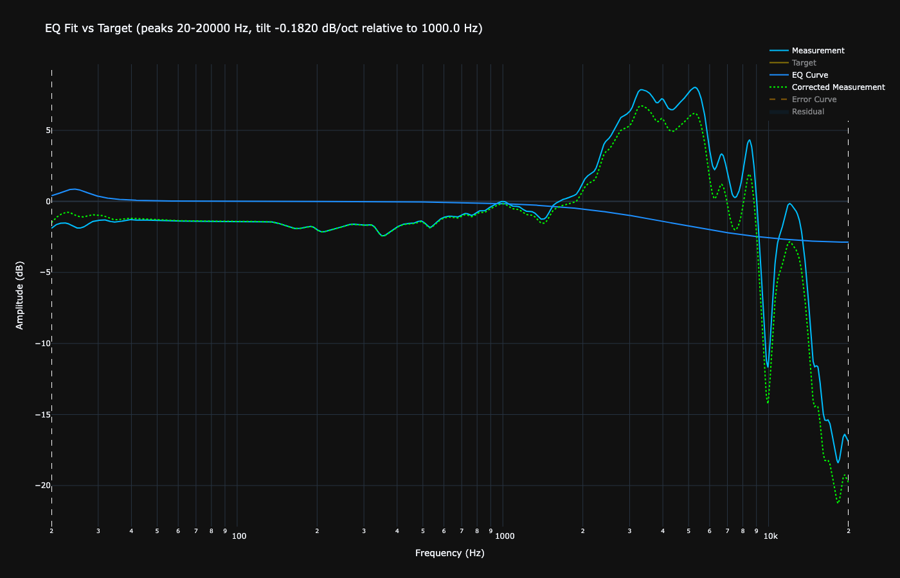
  </div>

```text
Preamp: -0.9 dB
Filter 1: ON PK Fc 24.32 Hz Gain 0.87 dB Q 2.794
Filter 2: ON PK Fc 19506.64 Hz Gain -2.86 dB Q 0.083
```

</details>

<details>
  <summary><strong>HIFIMAN Edition XS</strong></summary>

  <div align="center">
    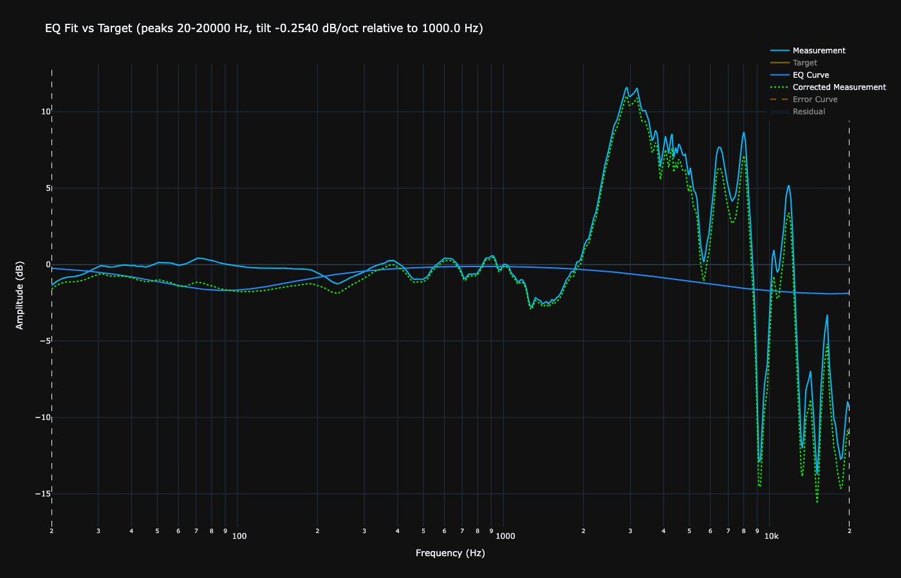
  </div>

```text
Preamp: 0.1 dB
Filter 1: ON PK Fc 90.20 Hz Gain -1.69 dB Q 0.580
Filter 2: ON PK Fc 17371.49 Hz Gain -1.91 dB Q 0.139
```

</details>

<details>
  <summary><strong>HIFIMAN Edition XV</strong></summary>

  <div align="center">
    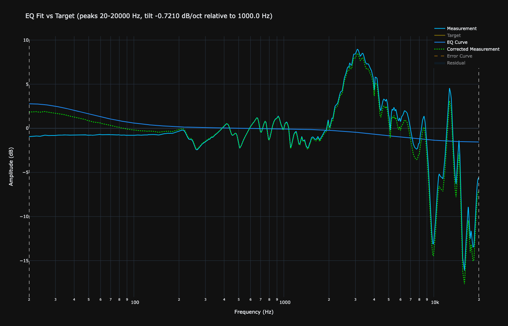
  </div>

```text
Preamp: -2.8 dB
Filter 1: ON PK Fc 20.00 Hz Gain 2.78 dB Q 0.401
Filter 2: ON PK Fc 20000.00 Hz Gain -1.56 dB Q 0.084
```

</details>

<details>
  <summary><strong>HIFIMAN HE1000 Unveiled</strong></summary>

  <div align="center">
    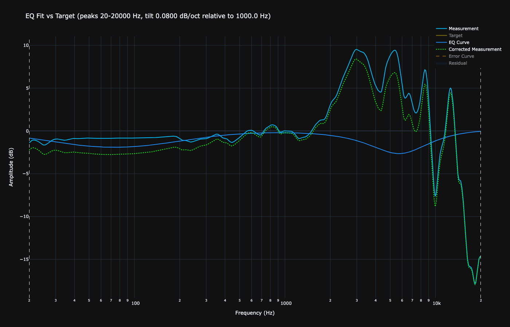
  </div>

```text
Preamp: 0.3 dB
Filter 1: ON PK Fc 73.50 Hz Gain -1.91 dB Q 0.336
Filter 2: ON PK Fc 16217.48 Hz Gain -1.31 dB Q 0.093
```

</details>

<details>
  <summary><strong>HIFIMAN HE560</strong></summary>

  <div align="center">
    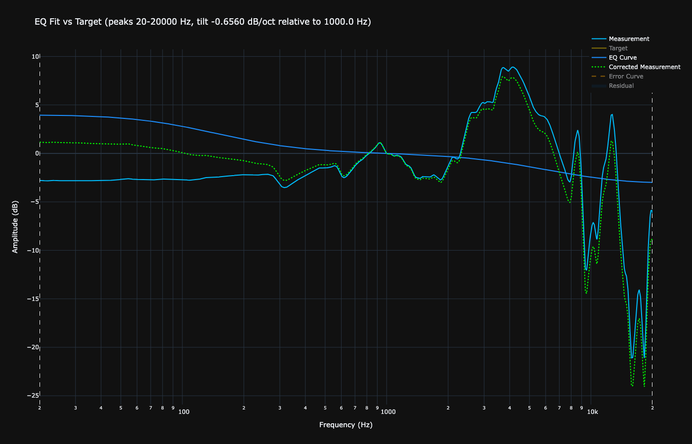
  </div>

```text
Preamp: -4.0 dB
Filter 1: ON PK Fc 20.00 Hz Gain 3.97 dB Q 0.136
Filter 2: ON PK Fc 19999.94 Hz Gain -2.99 dB Q 0.099
```

</details>

<details>
  <summary><strong>HIFIMAN HE600</strong></summary>

  <div align="center">
    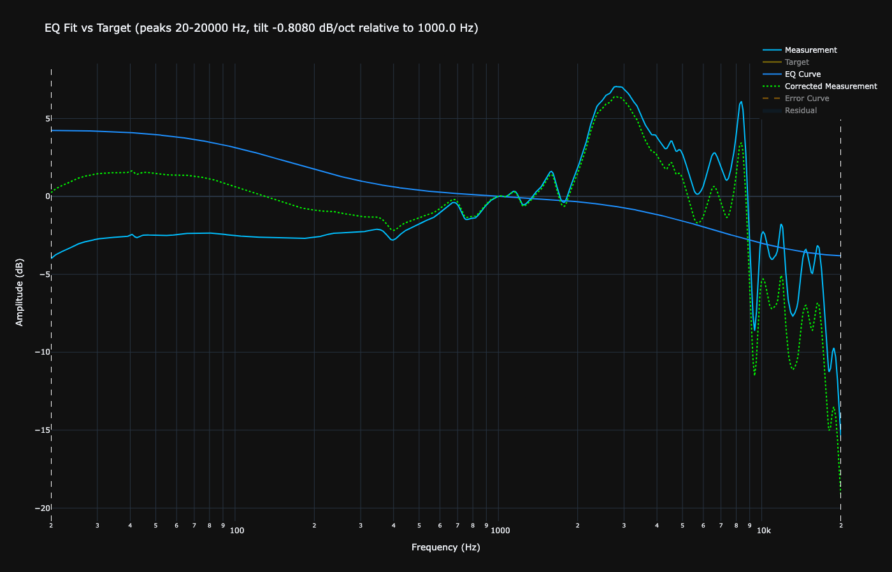
  </div>

```text
Preamp: -4.2 dB
Filter 1: ON PK Fc 20.00 Hz Gain 4.23 dB Q 0.122
Filter 2: ON PK Fc 20000.00 Hz Gain -4.41 dB Q 0.111
```

</details>

<details>
  <summary><strong>HIFIMAN Sundara</strong></summary>

  <div align="center">
    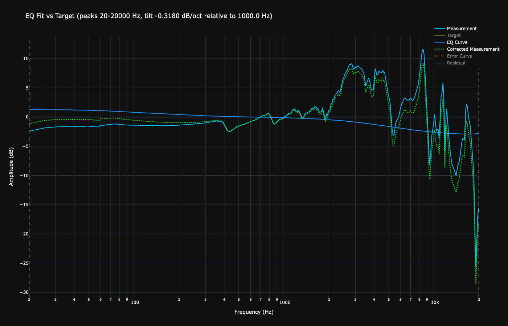
  </div>

```text
Preamp: -1.3 dB
Filter 1: ON PK Fc 20.00 Hz Gain 1.29 dB Q 0.150
Filter 2: ON PK Fc 16981.07 Hz Gain -2.92 dB Q 0.154
```

</details>

<details>
  <summary><strong>HIFIMAN Sundara Closed-Back</strong></summary>

  <div align="center">
    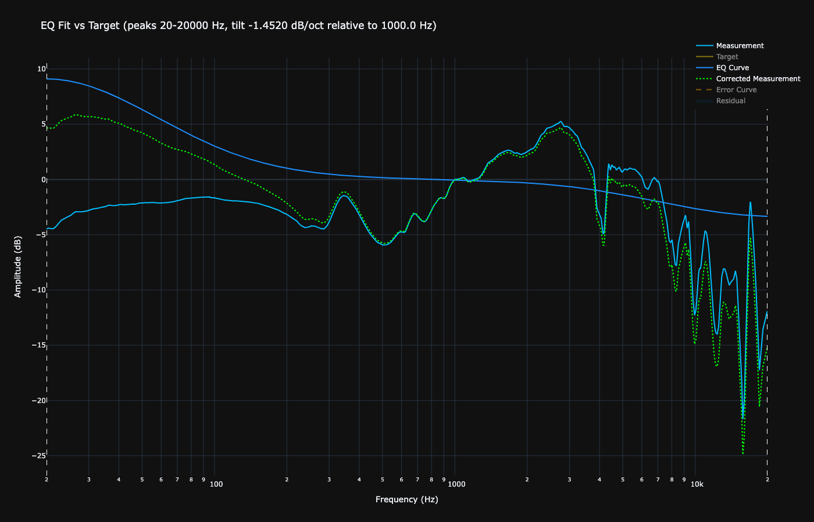
  </div>

```text
Preamp: -9.1 dB
Filter 1: ON PK Fc 20.00 Hz Gain 9.10 dB Q 0.305
Filter 2: ON PK Fc 20000.00 Hz Gain -3.34 dB Q 0.109
```

</details>

<details>
  <summary><strong>HIFIMAN Sundara Silver</strong></summary>

  <div align="center">
    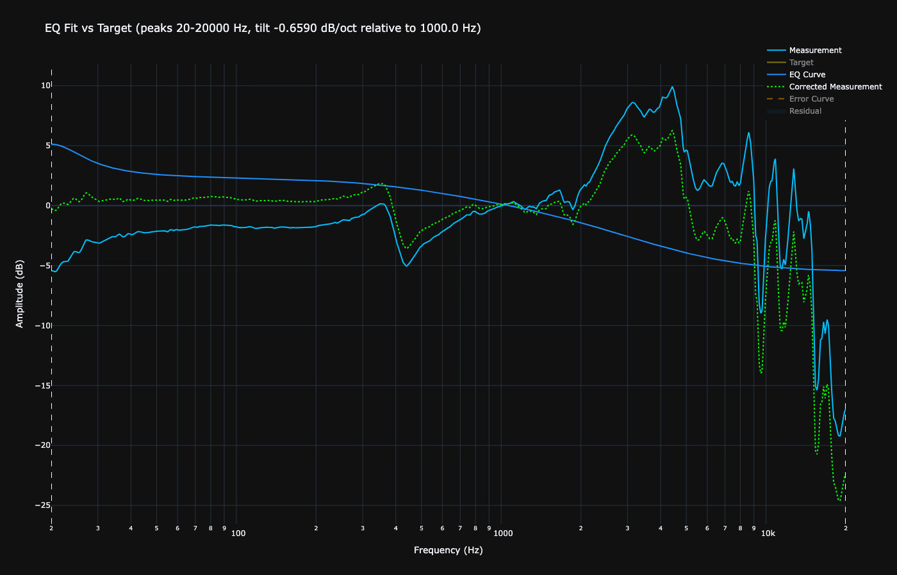
  </div>

```text
Preamp: -5.1 dB
Filter 1: ON PK Fc 20.00 Hz Gain 2.82 dB Q 1.384
Filter 2: ON PK Fc 20.00 Hz Gain 2.31 dB Q 0.032
Filter 3: ON PK Fc 20000.00 Hz Gain -5.41 dB Q 0.054
```

</details>

<details>
  <summary><strong>HIFIMAN Susvara Unveiled</strong></summary>

  <div align="center">
    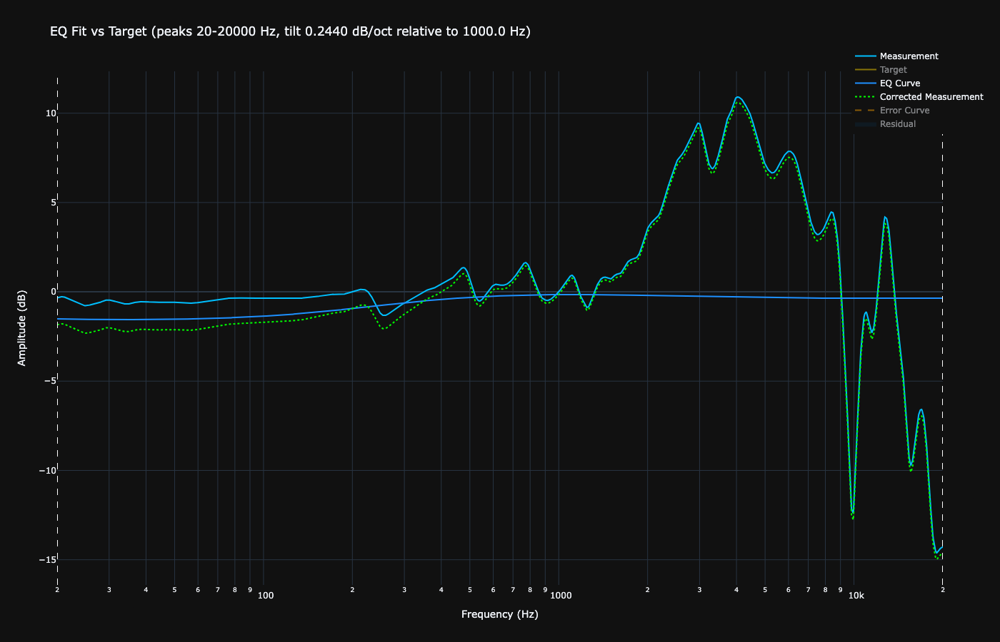
  </div>

```text
Preamp: 0.2 dB
Filter 1: ON PK Fc 33.72 Hz Gain -1.55 dB Q 0.141
Filter 2: ON PK Fc 15342.46 Hz Gain -0.37 dB Q 0.085
```

</details>

<details>
  <summary><strong>Meze Audio 105 AER</strong></summary>

  <div align="center">
    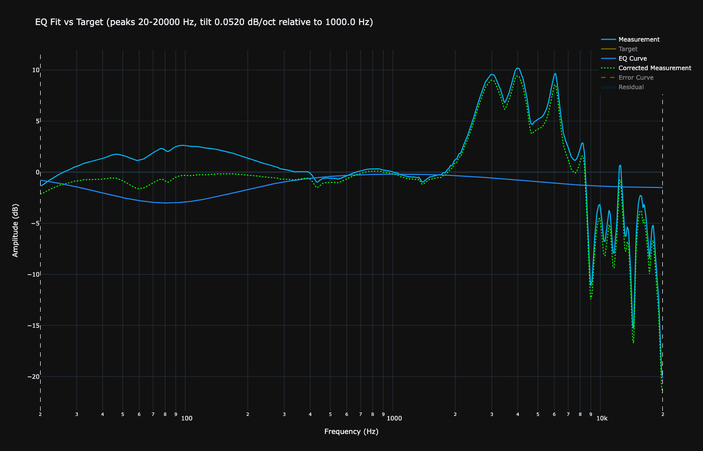
  </div>

```text
Preamp: 0.2 dB
Filter 1: ON PK Fc 82.14 Hz Gain -3.01 dB Q 0.440
Filter 2: ON PK Fc 19983.54 Hz Gain -1.51 dB Q 0.070
```

</details>

<details>
  <summary><strong>Meze Audio 105 Silva</strong></summary>

  <div align="center">
    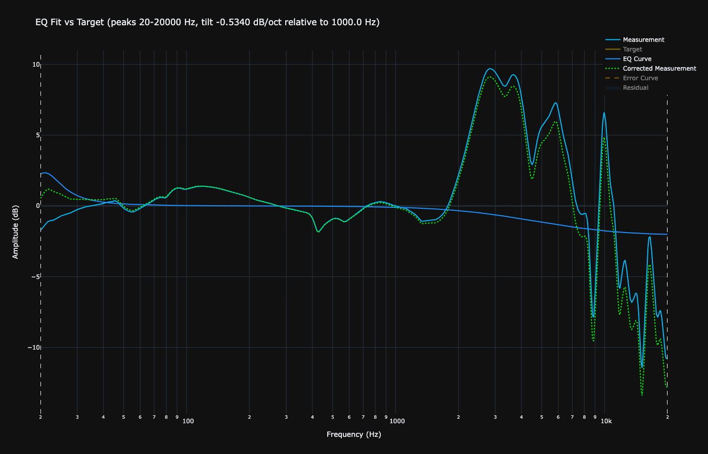
  </div>

```text
Preamp: -2.3 dB
Filter 1: ON PK Fc 20.95 Hz Gain 2.34 dB Q 2.042
Filter 2: ON PK Fc 20000.00 Hz Gain -2.01 dB Q 0.079
```

</details>

<details>
  <summary><strong>Meze Audio 109 Pro</strong></summary>

  <div align="center">
    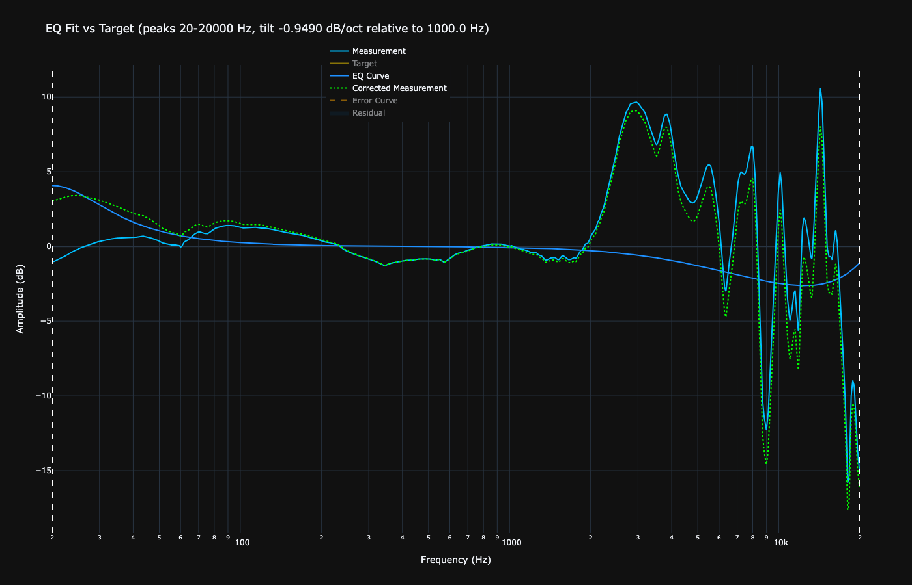
  </div>

```text
Preamp: -4.1 dB
Filter 1: ON PK Fc 20.00 Hz Gain 4.08 dB Q 0.824
Filter 2: ON PK Fc 12414.91 Hz Gain -2.62 dB Q 0.365
```

</details>

<details>
  <summary><strong>Meze Audio 99 CLASSICS</strong></summary>

  <div align="center">
    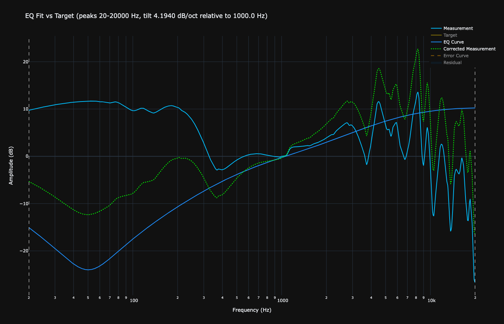
  </div>

```text
Preamp: -10.2 dB
Filter 1: ON PK Fc 50.18 Hz Gain -24.00 dB Q 0.316
Filter 2: ON PK Fc 20000.00 Hz Gain 10.25 dB Q 0.052
```

</details>

<details>
  <summary><strong>Meze Audio 2ND GEN 99 CLASSICS</strong></summary>

  <div align="center">
    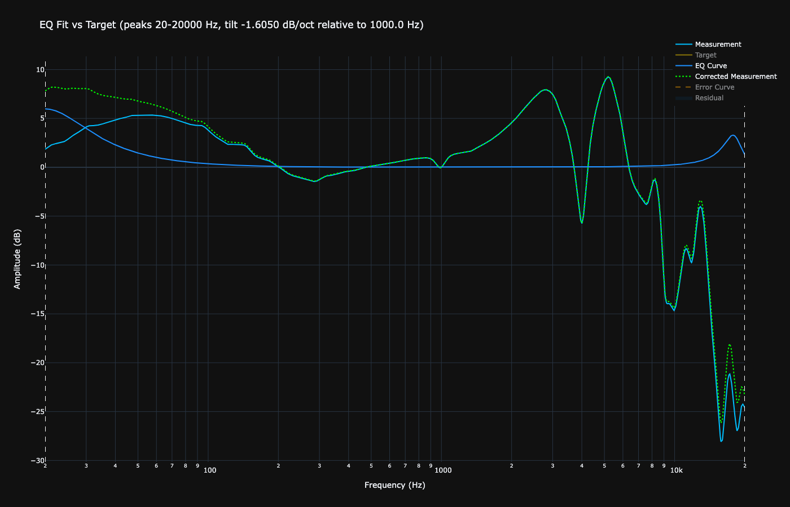
  </div>

```text
Preamp: -6.0 dB
Filter 1: ON PK Fc 20.00 Hz Gain 5.97 dB Q 0.853
Filter 2: ON PK Fc 17787.78 Hz Gain 3.29 dB Q 1.283
```

</details>

<details>
  <summary><strong>Meze Audio Empyrean II (Duo Pads)</strong></summary>

  <div align="center">
    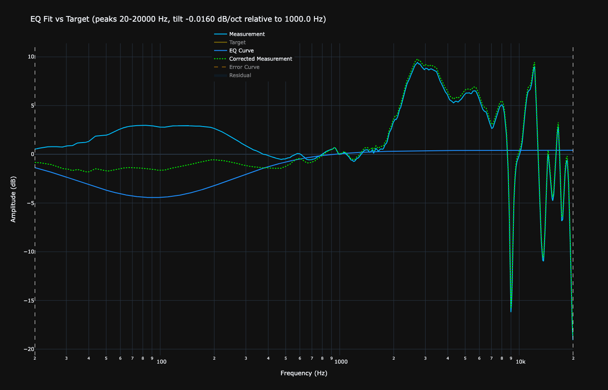
  </div>

```text
Preamp: -0.4 dB
Filter 1: ON PK Fc 94.05 Hz Gain -4.51 dB Q 0.340
Filter 2: ON PK Fc 11876.87 Hz Gain 0.41 dB Q 0.015
```

</details>

<details>
  <summary><strong>Meze Audio Strada</strong></summary>

  <div align="center">
    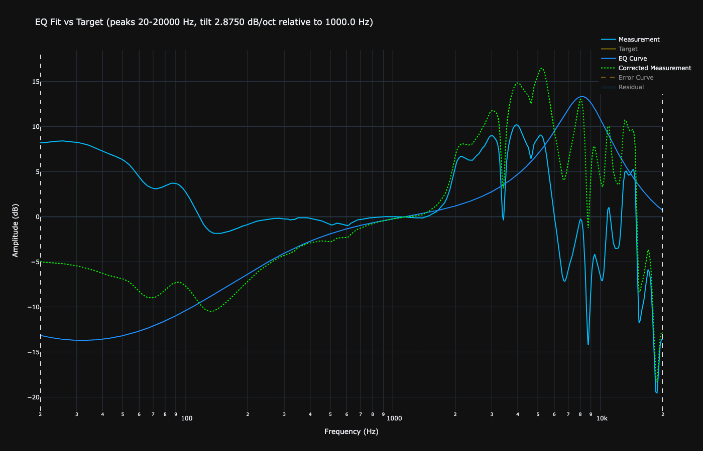
  </div>

```text
Preamp: -8.8 dB
Filter 1: ON PK Fc 20.00 Hz Gain -11.31 dB Q 0.092
Filter 2: ON PK Fc 20000.00 Hz Gain 8.83 dB Q 0.070
```

</details>

<details>
  <summary><strong>MIRPH Designs MIRPH-1</strong></summary>

  <div align="center">
    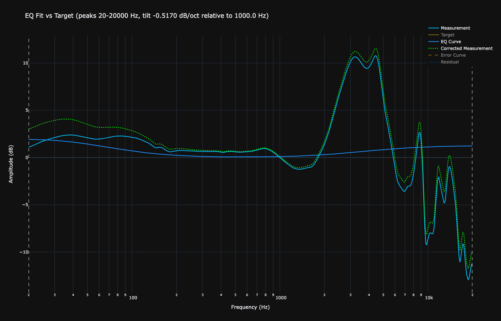
  </div>

```text
Preamp: -1.9 dB
Filter 1: ON PK Fc 20.00 Hz Gain 1.91 dB Q 0.278
Filter 2: ON PK Fc 20000.00 Hz Gain 1.22 dB Q 0.062
```

</details>

<details>
  <summary><strong>MOONDROP COSMO</strong></summary>

  <div align="center">
    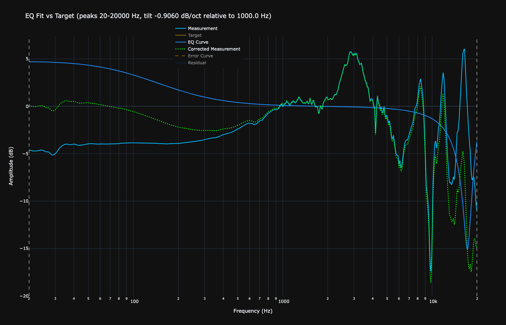
  </div>

```text
Preamp: -4.7 dB
Filter 1: ON PK Fc 20.00 Hz Gain 4.69 dB Q 0.134
Filter 2: ON PK Fc 17224.20 Hz Gain -15.10 dB Q 1.654
```

</details>

<details>
  <summary><strong>MOONDROP HORIZON</strong></summary>

  <div align="center">
    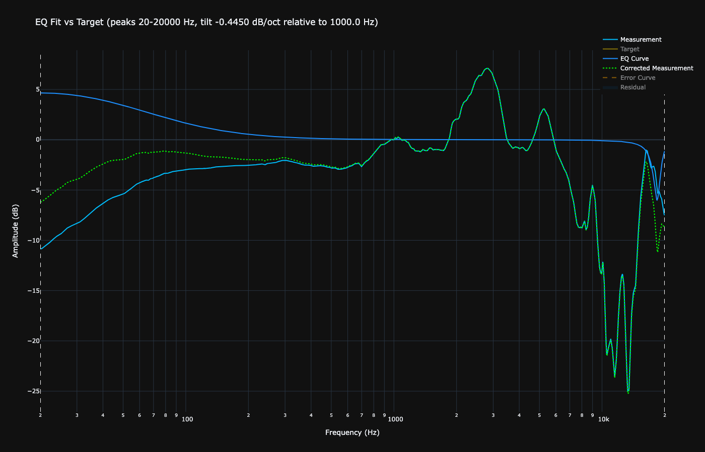
  </div>

```text
Preamp: -4.7 dB
Filter 1: ON PK Fc 20.00 Hz Gain 4.66 dB Q 0.284
Filter 2: ON PK Fc 18366.26 Hz Gain -6.00 dB Q 2.895
```

</details>

<details>
  <summary><strong>MOONDROP PARA2</strong></summary>

  <div align="center">
    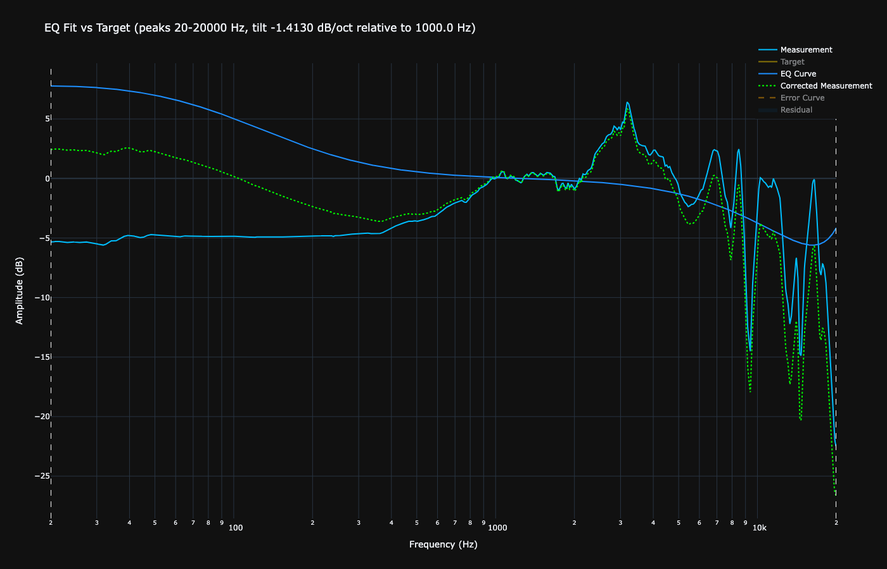
  </div>

```text
Preamp: -7.8 dB
Filter 1: ON PK Fc 20.00 Hz Gain 7.77 dB Q 0.151
Filter 2: ON PK Fc 16227.87 Hz Gain -5.60 dB Q 0.366
```

</details>

<details>
  <summary><strong>MOONDROP SKYLAND</strong></summary>

  <div align="center">
    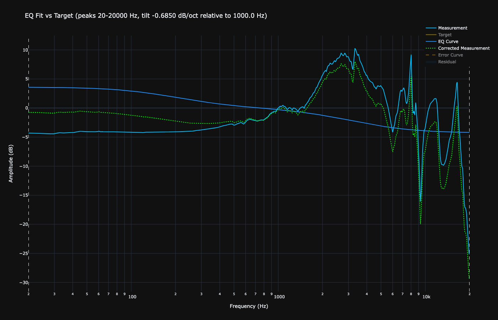
  </div>

```text
Preamp: -3.6 dB
Filter 1: ON PK Fc 20.00 Hz Gain 3.58 dB Q 0.097
Filter 2: ON PK Fc 20000.00 Hz Gain -4.18 dB Q 0.053
```

</details>

<details>
  <summary><strong>Neumann NDH 30</strong></summary>

  <div align="center">
    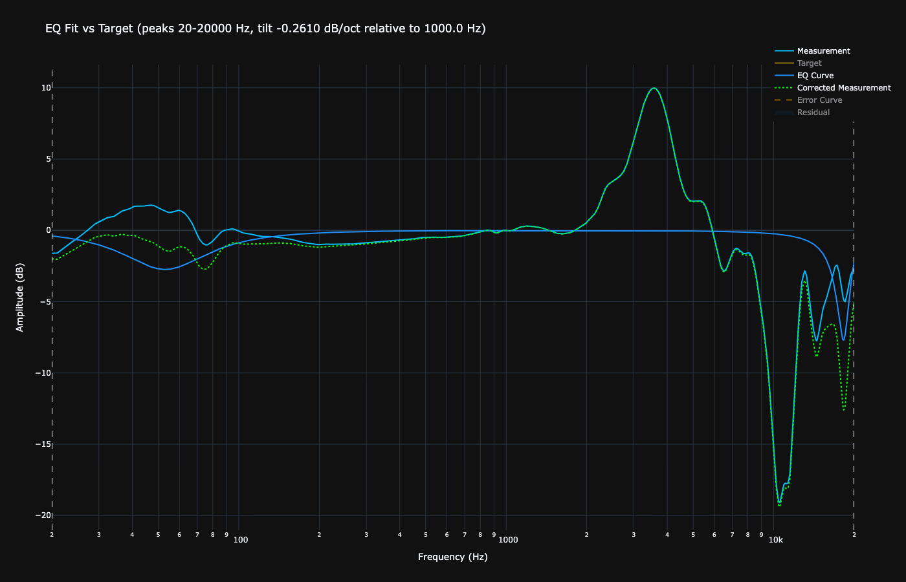
  </div>

```text
Preamp: 0.0 dB
Filter 1: ON PK Fc 3537.97 Hz Gain -2.17 dB Q 3.000
Filter 2: ON PK Fc 18216.56 Hz Gain -7.70 dB Q 2.037
```

</details>

<details>
  <summary><strong>NOTHING cmf headphone pro</strong></summary>

  <div align="center">
    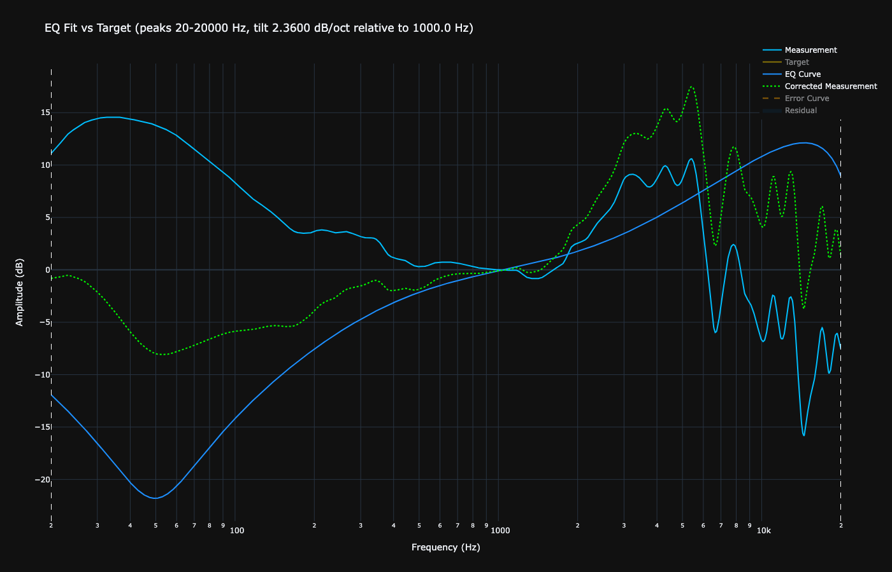
  </div>

```text
Preamp: -12.1 dB
Filter 1: ON PK Fc 49.71 Hz Gain -21.80 dB Q 0.419
Filter 2: ON PK Fc 14475.22 Hz Gain 12.13 dB Q 0.242
```

</details>

<details>
  <summary><strong>NOTHING headphone (1)</strong></summary>

  <div align="center">
    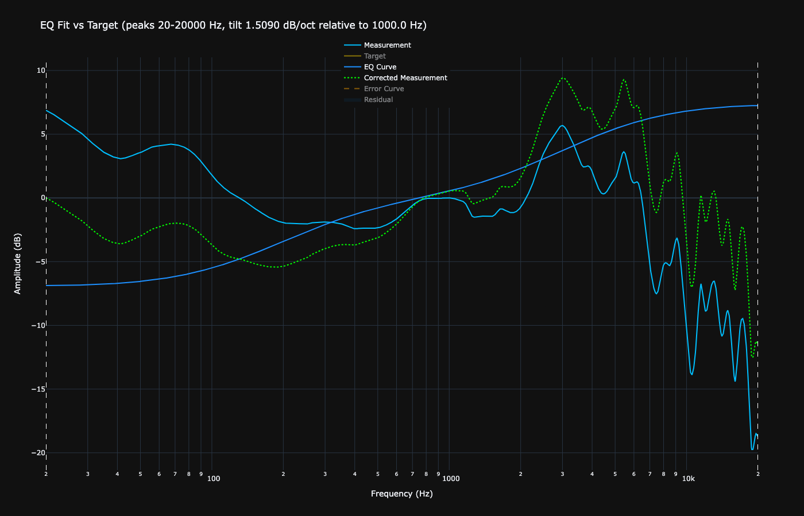
  </div>

```text
Preamp: -7.2 dB
Filter 1: ON PK Fc 20.00 Hz Gain -6.87 dB Q 0.101
Filter 2: ON PK Fc 20000.00 Hz Gain 7.25 dB Q 0.051
```

</details>

<details>
  <summary><strong>Philips SPH9600</strong></summary>

  <div align="center">
    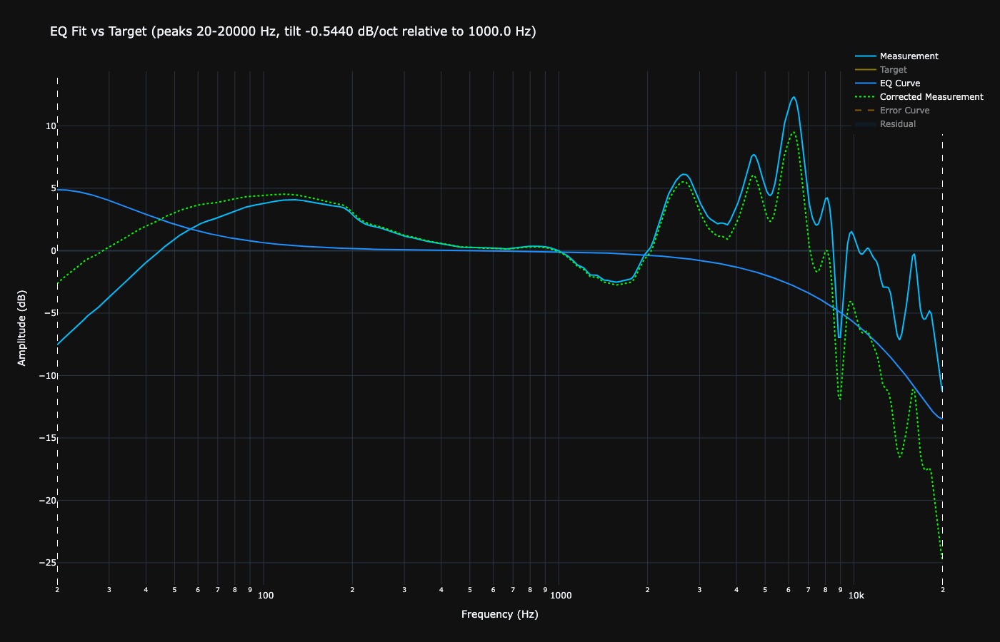
  </div>

```text
Preamp: -4.9 dB
Filter 1: ON PK Fc 20.00 Hz Gain 4.89 dB Q 0.547
Filter 2: ON PK Fc 19992.29 Hz Gain -13.47 dB Q 0.256
```

</details>

<details>
  <summary><strong>Sennheiser HD 280 Pro</strong></summary>

  <div align="center">
    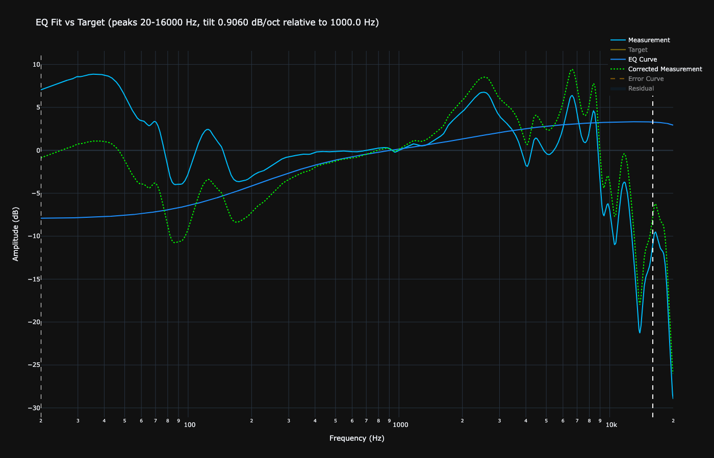
  </div>

```text
Preamp: -3.3 dB
Filter 1: ON PK Fc 20.01 Hz Gain -7.91 dB Q 0.095
Filter 2: ON PK Fc 13441.19 Hz Gain 3.33 dB Q 0.128
```

</details>

<details>
  <summary><strong>Sennheiser HD 490 Pro (Mixing Pads)</strong></summary>

  <div align="center">
    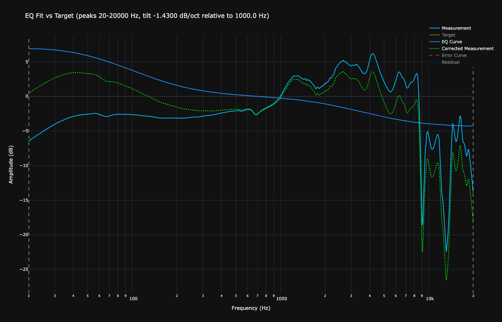
  </div>

```text
Preamp: -6.9 dB
Filter 1: ON PK Fc 20.00 Hz Gain 6.88 dB Q 0.190
Filter 2: ON PK Fc 20000.00 Hz Gain -4.30 dB Q 0.060
```

</details>

<details>
  <summary><strong>Sennheiser HD 505</strong></summary>

  <div align="center">
    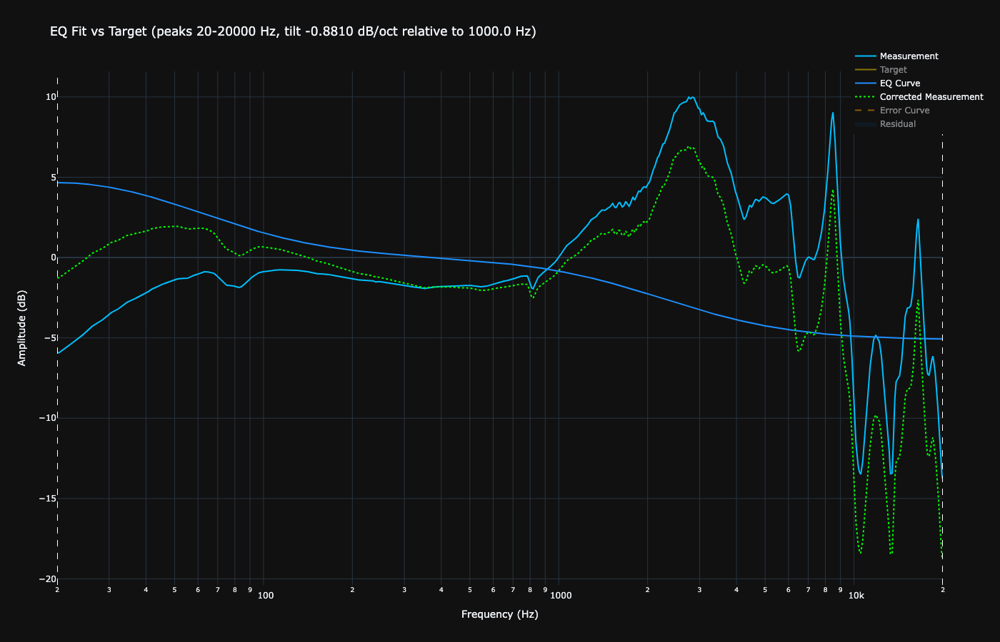
  </div>

```text
Preamp: -4.7 dB
Filter 1: ON PK Fc 20.00 Hz Gain 4.66 dB Q 0.298
Filter 2: ON PK Fc 20000.00 Hz Gain -5.07 dB Q 0.039
```

</details>

<details>
  <summary><strong>Sennheiser HD 550</strong></summary>

  <div align="center">
    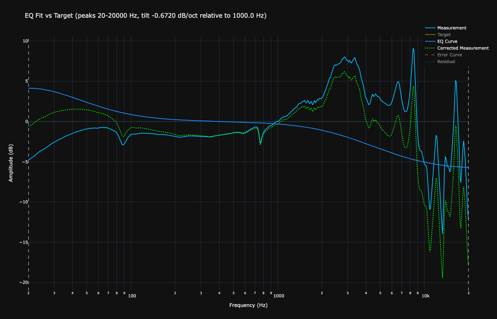
  </div>

```text
Preamp: -4.1 dB
Filter 1: ON PK Fc 20.00 Hz Gain 4.14 dB Q 0.410
Filter 2: ON PK Fc 20000.00 Hz Gain -5.70 dB Q 0.074
```

</details>

<details>
  <summary><strong>Sennheiser HD 560S</strong></summary>

  <div align="center">
    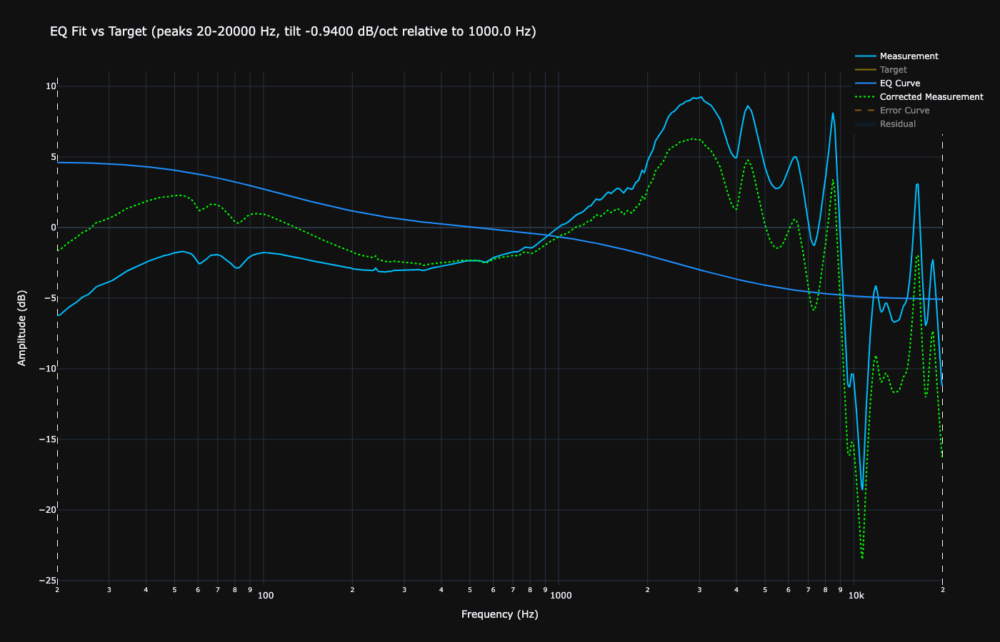
  </div>

```text
Preamp: -4.6 dB
Filter 1: ON PK Fc 20.00 Hz Gain 4.60 dB Q 0.172
Filter 2: ON PK Fc 19985.99 Hz Gain -5.07 dB Q 0.044
```

</details>

<details>
  <summary><strong>Sennheiser HD 580 Precision</strong></summary>

  <div align="center">
    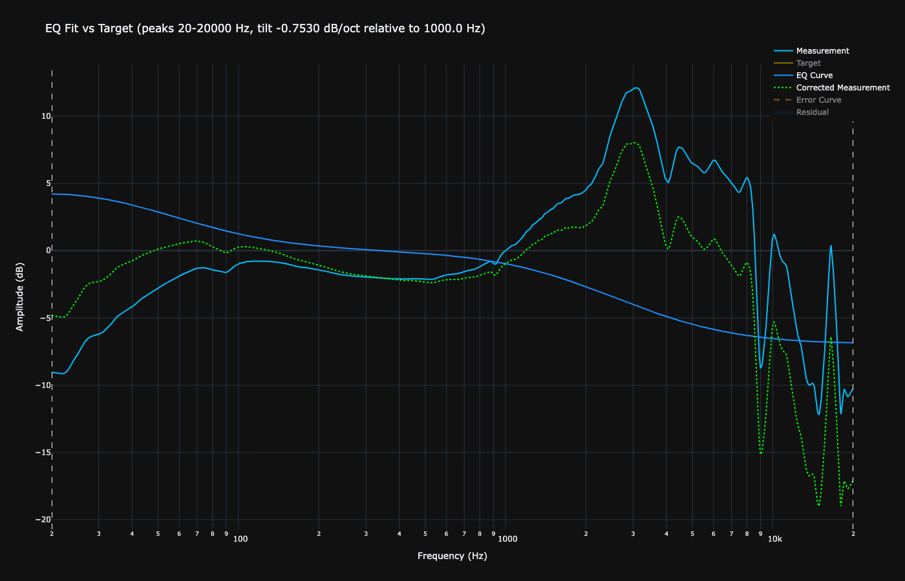
  </div>

```text
Preamp: -4.2 dB
Filter 1: ON PK Fc 20.00 Hz Gain 4.20 dB Q 0.322
Filter 2: ON PK Fc 20000.00 Hz Gain -6.85 dB Q 0.044
```

</details>

<details>
  <summary><strong>Sennheiser HD 600</strong></summary>

  <div align="center">
    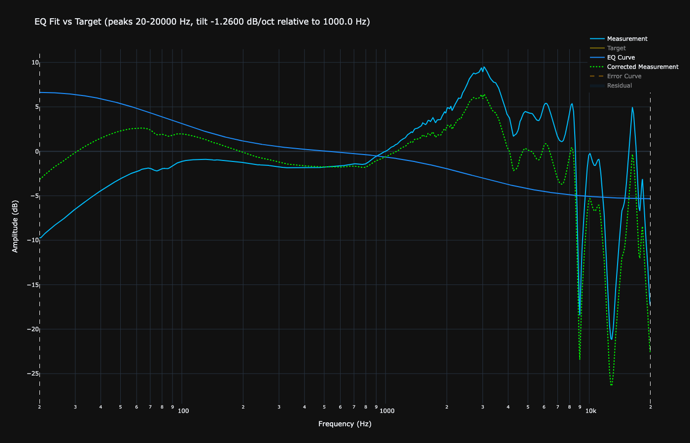
  </div>

```text
Preamp: -6.6 dB
Filter 1: ON PK Fc 20.00 Hz Gain 6.63 dB Q 0.223
Filter 2: ON PK Fc 20000.00 Hz Gain -5.33 dB Q 0.046
```

</details>

<details>
  <summary><strong>Sennheiser HD 620S</strong></summary>

  <div align="center">
    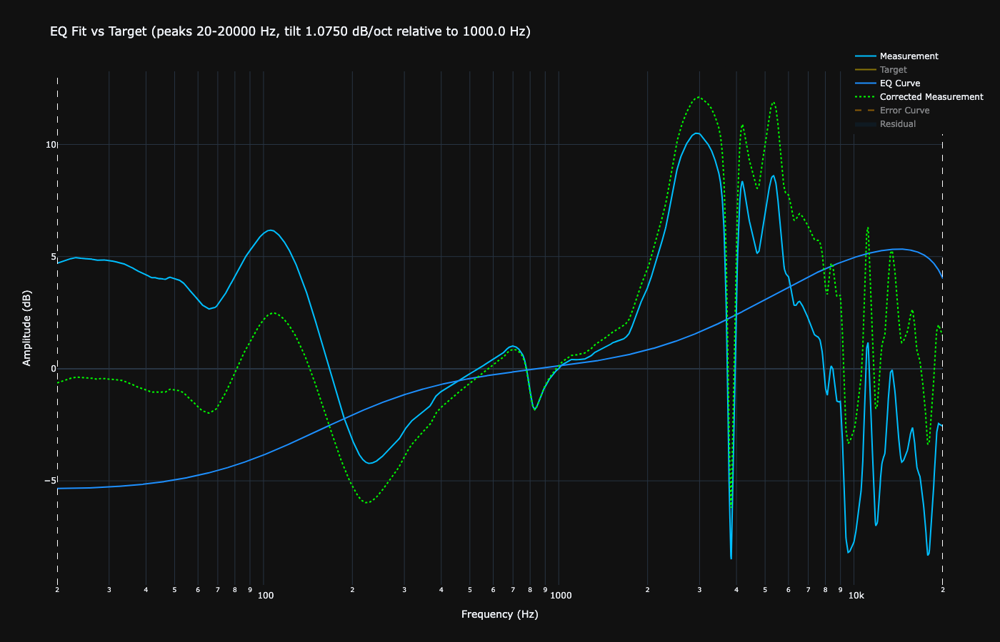
  </div>

```text
Preamp: -5.3 dB
Filter 1: ON PK Fc 20.00 Hz Gain -5.34 dB Q 0.128
Filter 2: ON PK Fc 14169.30 Hz Gain 5.33 dB Q 0.230
```

</details>

<details>
  <summary><strong>Sennheiser HD 650</strong></summary>

  <div align="center">
    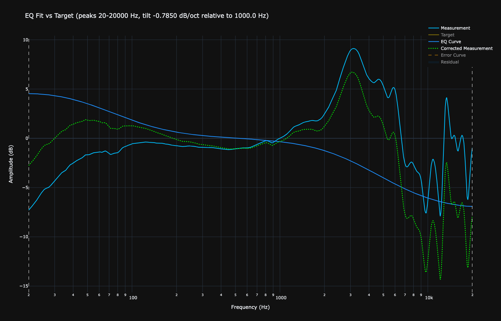
  </div>

```text
Preamp: -4.5 dB
Filter 1: ON PK Fc 20.00 Hz Gain 4.53 dB Q 0.253
Filter 2: ON PK Fc 20000.00 Hz Gain -6.92 dB Q 0.077
```

</details>

<details>
  <summary><strong>Sennheiser HD 660S2</strong></summary>

  <div align="center">
    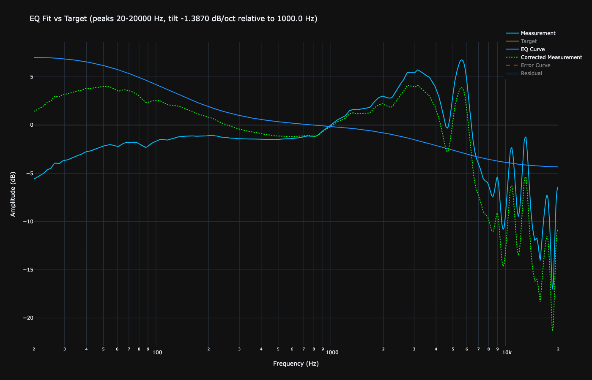
  </div>

```text
Preamp: -7.0 dB
Filter 1: ON PK Fc 20.00 Hz Gain 7.01 dB Q 0.169
Filter 2: ON PK Fc 20000.00 Hz Gain -4.34 dB Q 0.073
```

</details>

<details>
  <summary><strong>Sennheiser HD 800S</strong></summary>

  <div align="center">
    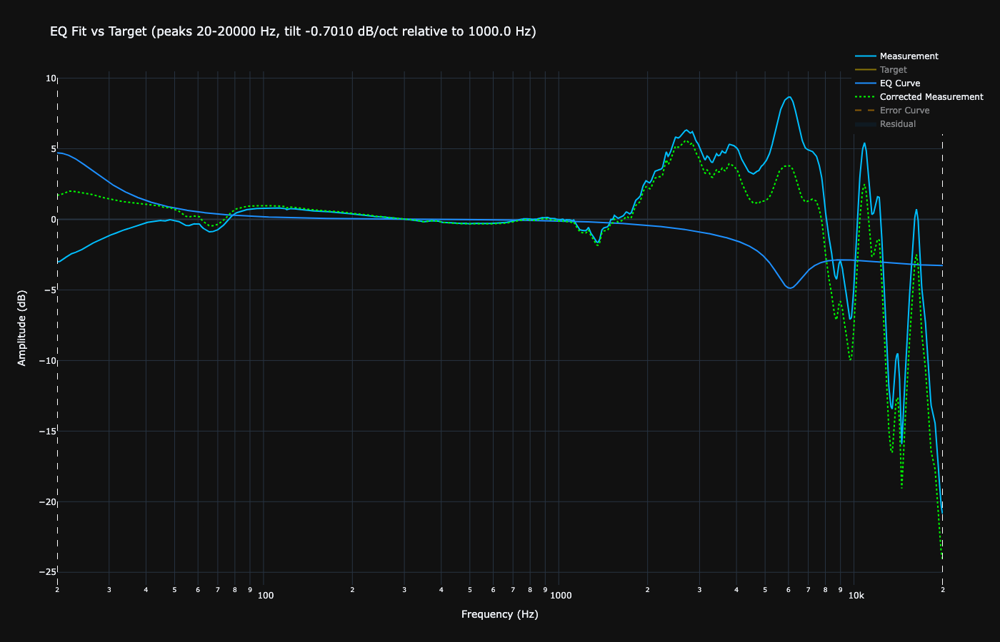
  </div>

```text
Preamp: -3.7 dB
Filter 1: ON PK Fc 20.48 Hz Gain 3.70 dB Q 1.438
Filter 2: ON PK Fc 19976.59 Hz Gain -3.63 dB Q 0.088
```

</details>

<details>
  <summary><strong>Sennheiser HD 820</strong></summary>

  <div align="center">
    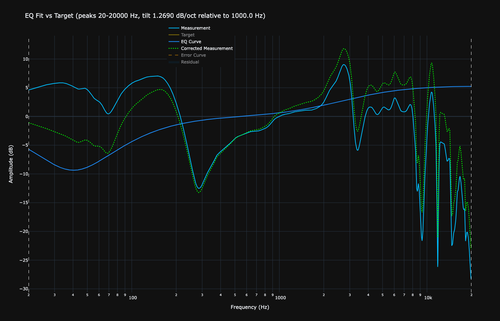
  </div>

```text
Preamp: -4.9 dB
Filter 1: ON PK Fc 38.77 Hz Gain -8.00 dB Q 0.465
Filter 2: ON PK Fc 19998.86 Hz Gain 4.91 dB Q 0.045
```

</details>

<details>
  <summary><strong>Sennheiser HDB 630 (ANC On)</strong></summary>

  <div align="center">
    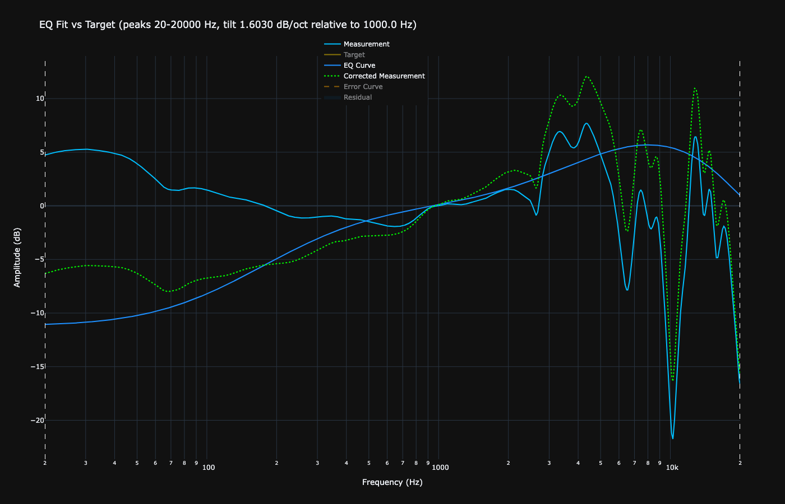
  </div>

```text
Preamp: -5.7 dB
Filter 1: ON PK Fc 76.84 Hz Gain -11.29 dB Q 0.016
Filter 2: ON PK Fc 1684.82 Hz Gain 10.96 dB Q 0.100
```

</details>

<details>
  <summary><strong>Sennheiser HE 1</strong></summary>

  <div align="center">
    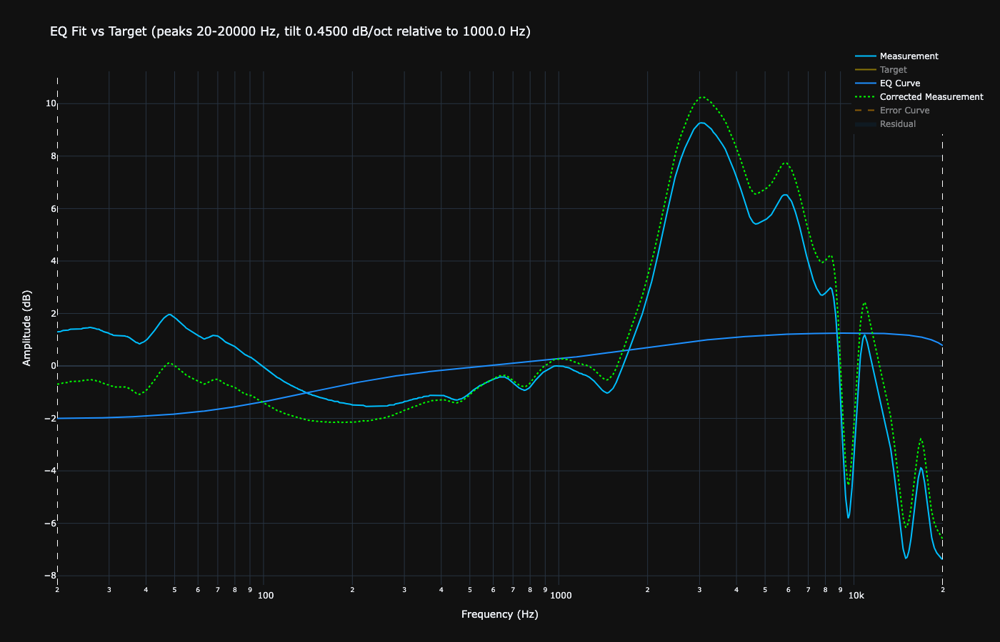
  </div>

```text
Preamp: -1.3 dB
Filter 1: ON PK Fc 20.00 Hz Gain -2.00 dB Q 0.141
Filter 2: ON PK Fc 9645.82 Hz Gain 1.26 dB Q 0.159
```

</details>

<details>
  <summary><strong>Sennheiser HE 60</strong></summary>

  <div align="center">
    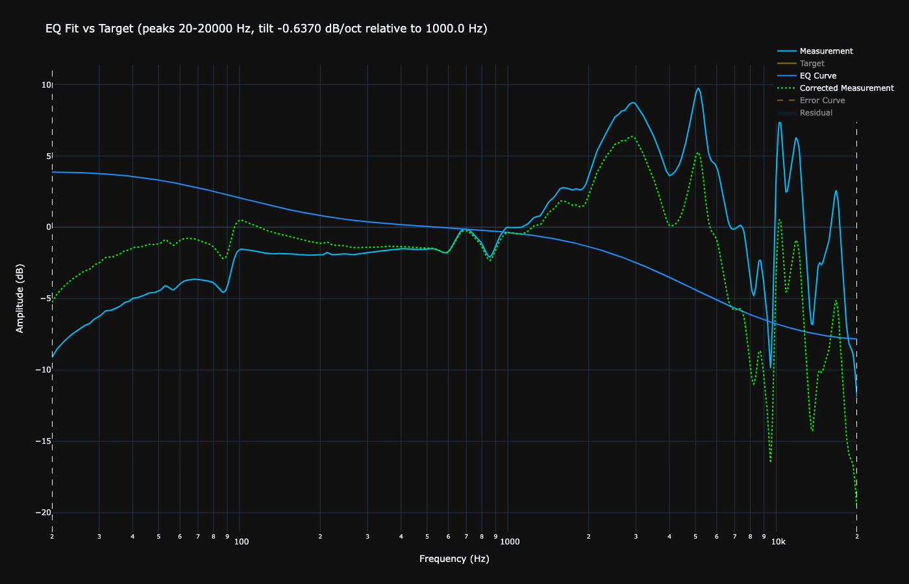
  </div>

```text
Preamp: -3.9 dB
Filter 1: ON PK Fc 20.00 Hz Gain 3.87 dB Q 0.194
Filter 2: ON PK Fc 20000.00 Hz Gain -7.82 dB Q 0.080
```

</details>

<details>
  <summary><strong>Sennheiser HE 90</strong></summary>

  <div align="center">
    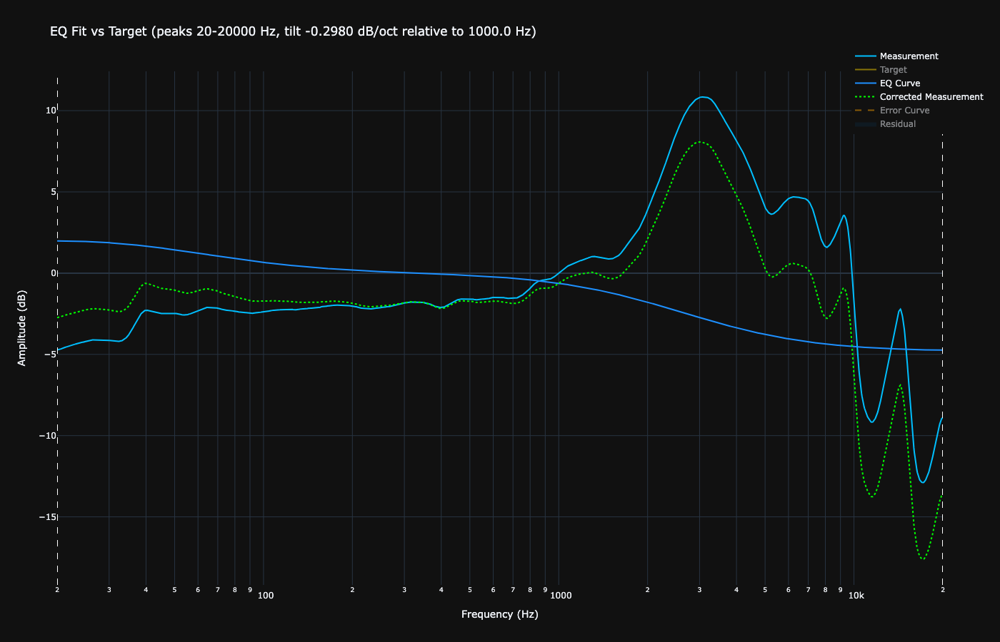
  </div>

```text
Preamp: -2.0 dB
Filter 1: ON PK Fc 20.00 Hz Gain 1.98 dB Q 0.293
Filter 2: ON PK Fc 20000.00 Hz Gain -4.73 dB Q 0.045
```

</details>

<details>
  <summary><strong>Sennheiser Momentum 4</strong></summary>

  <div align="center">
    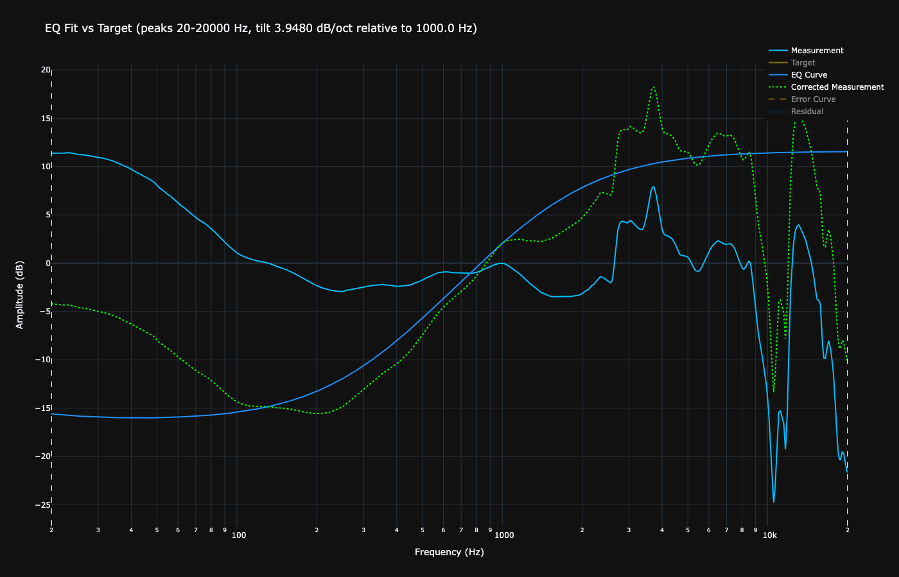
  </div>

```text
Preamp: -11.5 dB
Filter 1: ON PK Fc 48.20 Hz Gain -16.08 dB Q 0.069
Filter 2: ON PK Fc 19979.05 Hz Gain 11.55 dB Q 0.011
```

</details>

<details>
  <summary><strong>Shanling HW600</strong></summary>

  <div align="center">
    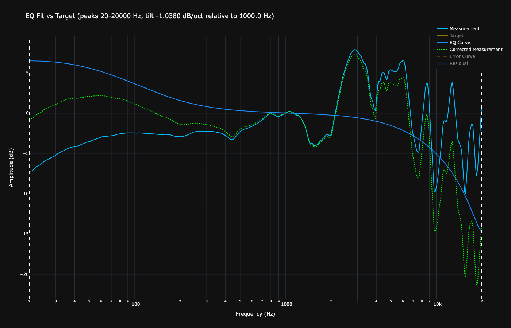
  </div>

```text
Preamp: -6.5 dB
Filter 1: ON PK Fc 20.00 Hz Gain 6.47 dB Q 0.184
Filter 2: ON PK Fc 20000.00 Hz Gain -14.60 dB Q 0.316
```

</details>

<details>
  <summary><strong>Shure SRH840A</strong></summary>

  <div align="center">
    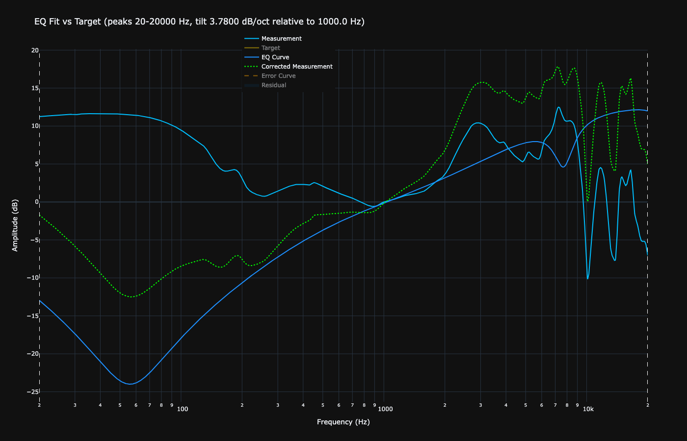
  </div>

```text
Preamp: -11.8 dB
Filter 1: ON PK Fc 55.14 Hz Gain -24.00 dB Q 0.383
Filter 2: ON PK Fc 20000.00 Hz Gain 11.81 dB Q 0.059
```

</details>

<details>
  <summary><strong>Shure SRH1840</strong></summary>

  <div align="center">
    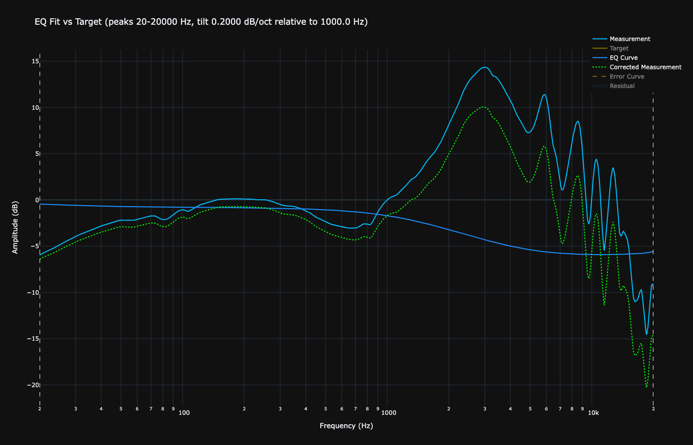
  </div>

```text
Preamp: 0.4 dB
Filter 1: ON PK Fc 404.67 Hz Gain -0.80 dB Q 0.045
Filter 2: ON PK Fc 15446.61 Hz Gain -5.75 dB Q 0.097
```

</details>

<details>
  <summary><strong>Simgot EP5</strong></summary>

  <div align="center">
    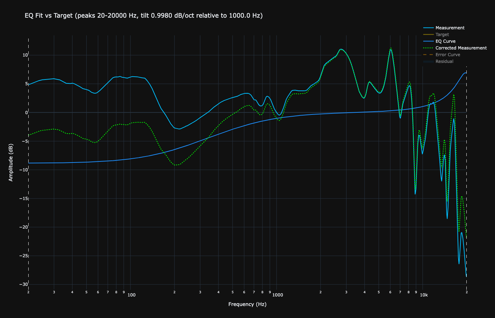
  </div>

```text
Preamp: -6.9 dB
Filter 1: ON PK Fc 20.00 Hz Gain -8.82 dB Q 0.059
Filter 2: ON PK Fc 19612.12 Hz Gain 6.92 dB Q 0.588
```

</details>

<details>
  <summary><strong>SIVGA Anser</strong></summary>

  <div align="center">
    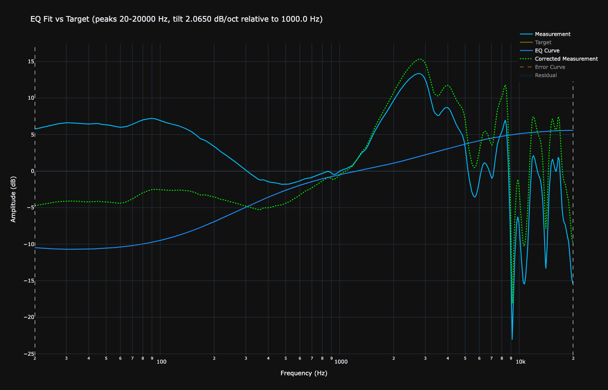
  </div>

```text
Preamp: -5.6 dB
Filter 1: ON PK Fc 33.25 Hz Gain -10.70 dB Q 0.121
Filter 2: ON PK Fc 19096.88 Hz Gain 5.58 dB Q 0.079
```

</details>

<details>
  <summary><strong>Sony MDR-7506</strong></summary>

  <div align="center">
    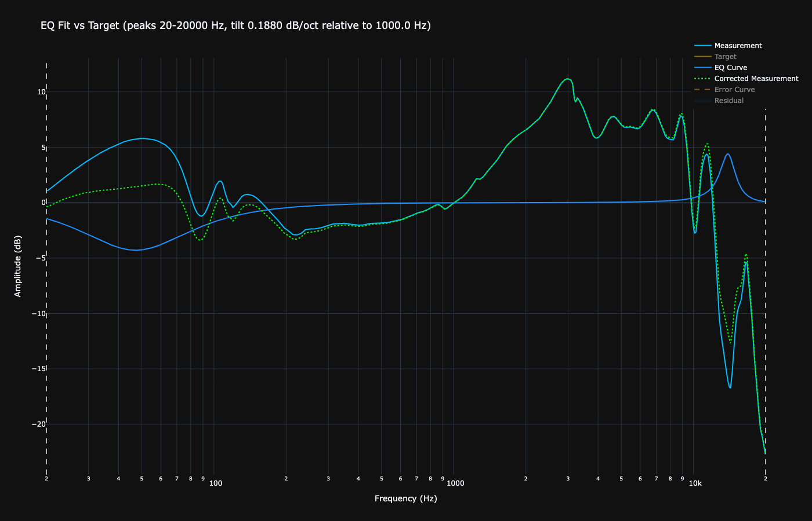
  </div>

```text
Preamp: -1.7 dB
Filter 1: ON PK Fc 47.11 Hz Gain -4.29 dB Q 0.738
Filter 2: ON PK Fc 17375.09 Hz Gain 1.69 dB Q 0.736
```

</details>

<details>
  <summary><strong>Sony MDR-M1</strong></summary>

  <div align="center">
    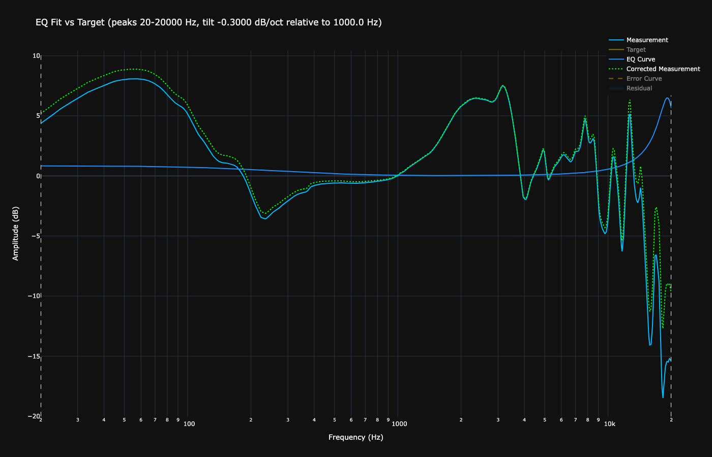
  </div>

```text
Preamp: -6.5 dB
Filter 1: ON PK Fc 20.06 Hz Gain 0.83 dB Q 0.078
Filter 2: ON PK Fc 19147.43 Hz Gain 6.50 dB Q 0.918
```

</details>

<details>
  <summary><strong>Sony MDR-MV1</strong></summary>

  <div align="center">
    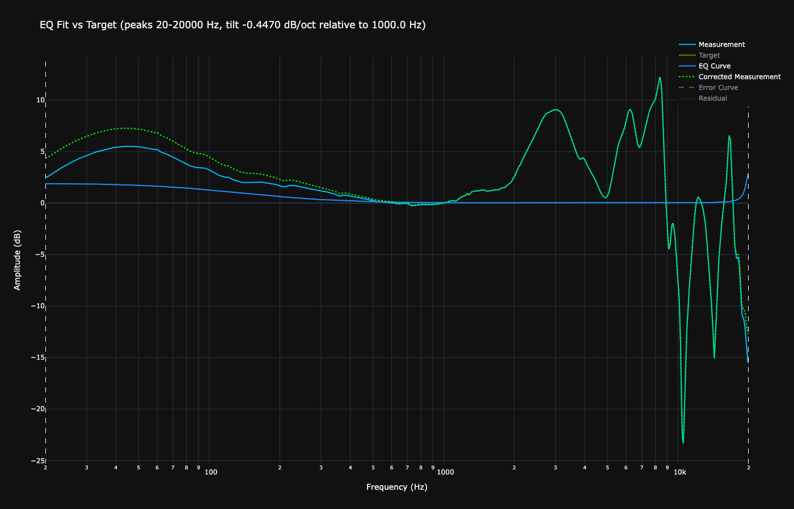
  </div>

```text
Preamp: -2.9 dB
Filter 1: ON PK Fc 20.00 Hz Gain 1.88 dB Q 0.144
Filter 2: ON PK Fc 20000.00 Hz Gain 2.92 dB Q 3.000
```

</details>

<details>
  <summary><strong>Sony WH-1000XM4</strong></summary>

  <div align="center">
    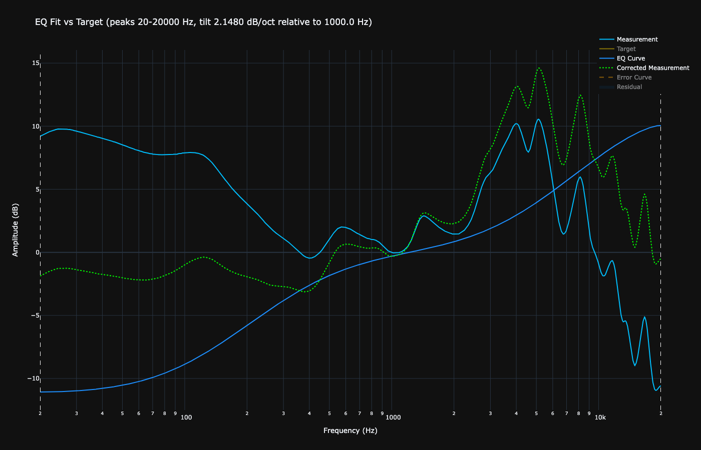
  </div>

```text
Preamp: -10.1 dB
Filter 1: ON PK Fc 20.00 Hz Gain -11.07 dB Q 0.096
Filter 2: ON PK Fc 20000.00 Hz Gain 10.06 dB Q 0.116
```

</details>

<details>
  <summary><strong>STAX SR-X9000</strong></summary>

  <div align="center">
    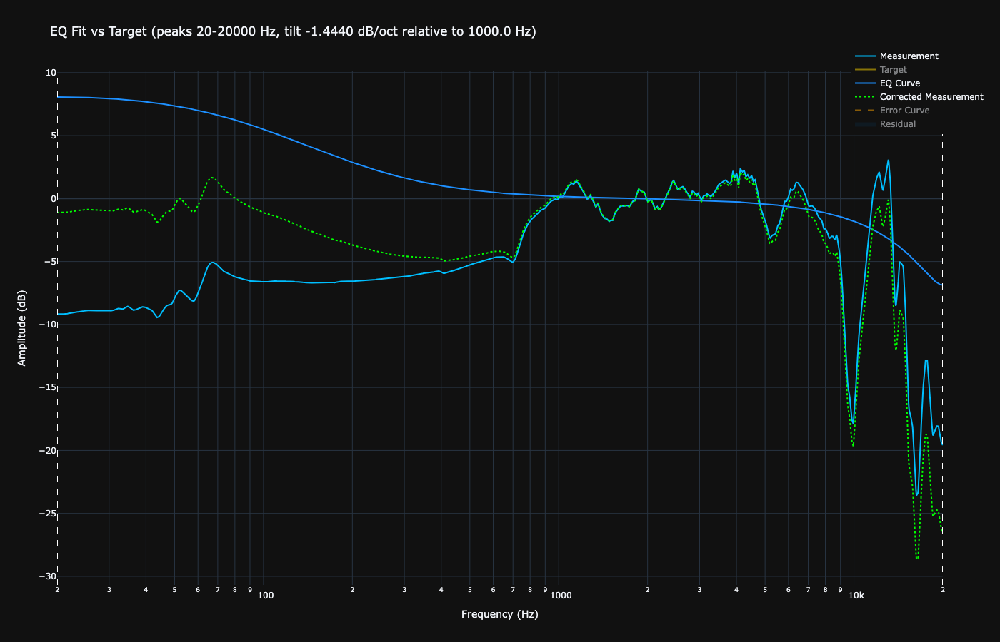
  </div>

```text
Preamp: -8.1 dB
Filter 1: ON PK Fc 20.00 Hz Gain 8.06 dB Q 0.139
Filter 2: ON PK Fc 20000.00 Hz Gain -6.87 dB Q 0.369
```

</details>

<details>
  <summary><strong>Superlux HD660PRO</strong></summary>

  <div align="center">
    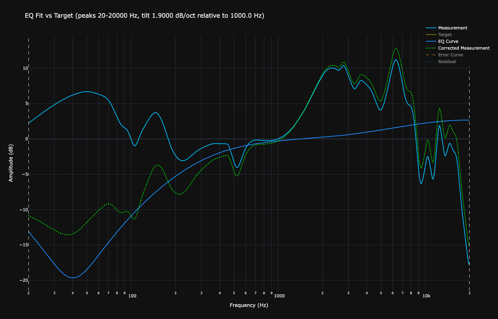
  </div>

```text
Preamp: -2.7 dB
Filter 1: ON PK Fc 40.12 Hz Gain -19.22 dB Q 0.402
Filter 2: ON PK Fc 19097.14 Hz Gain 2.68 dB Q 0.118
```

</details>

<details>
  <summary><strong>Superlux HD681</strong></summary>

  <div align="center">
    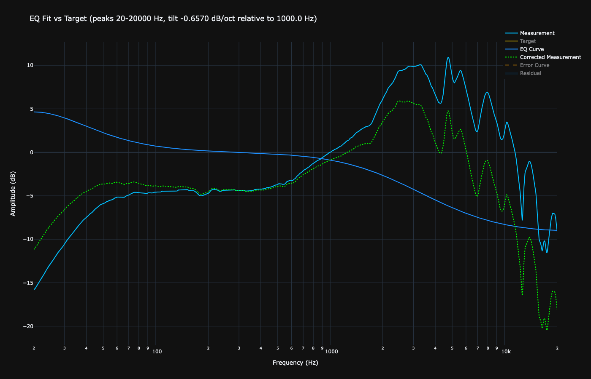
  </div>

```text
Preamp: -4.6 dB
Filter 1: ON PK Fc 20.00 Hz Gain 4.65 dB Q 0.492
Filter 2: ON PK Fc 20000.00 Hz Gain -8.97 dB Q 0.056
```

</details>

<details>
  <summary><strong>THIEAUDIO Cypher</strong></summary>

  <div align="center">
    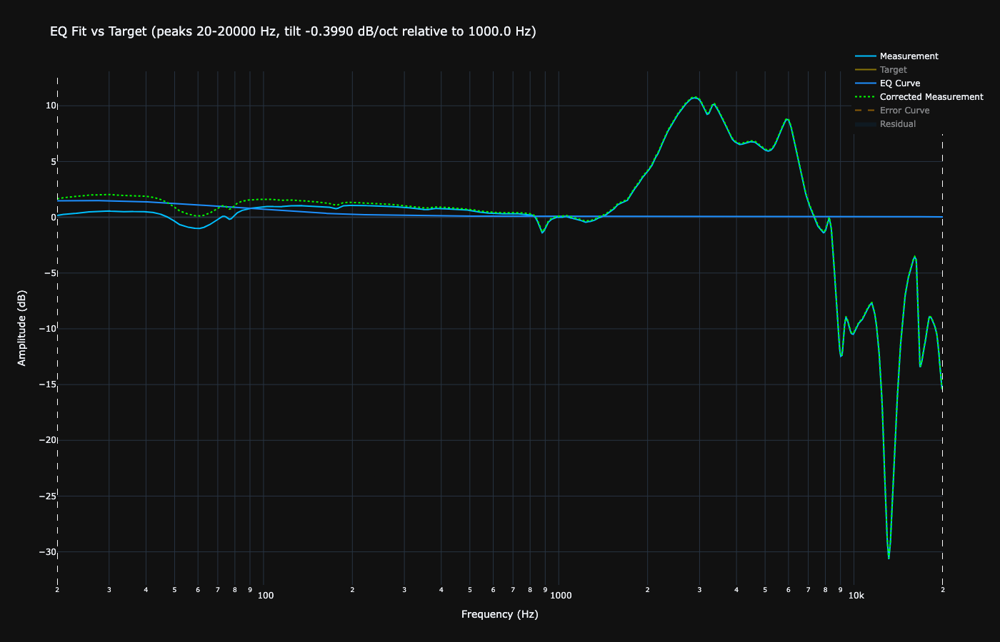
  </div>

```text
Preamp: -1.5 dB
Filter 1: ON PK Fc 23.93 Hz Gain 1.51 dB Q 0.283
Filter 2: ON PK Fc 3511.06 Hz Gain 0.09 dB Q 0.081
```

</details>

<details>
  <summary><strong>ZMFheadphones Aeolus</strong></summary>

  <div align="center">
    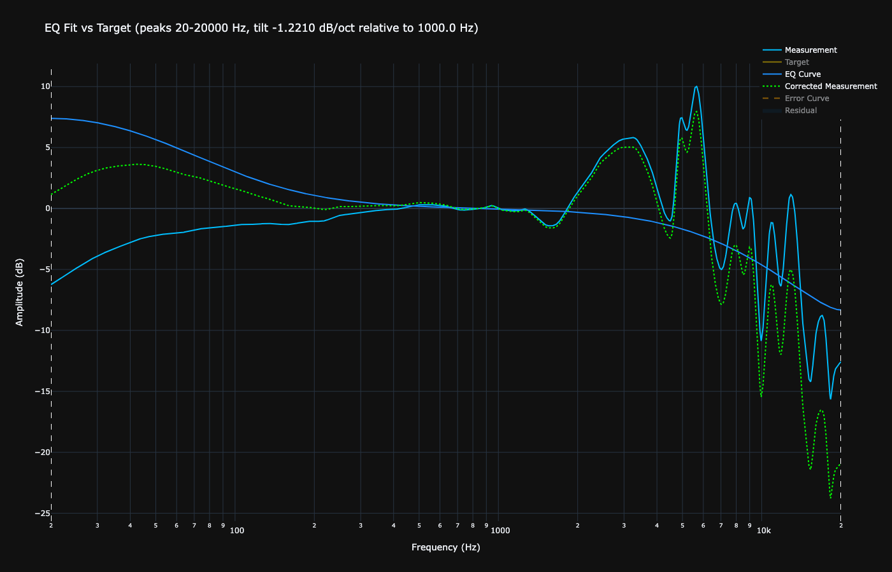
  </div>

```text
Preamp: -7.4 dB
Filter 1: ON PK Fc 20.00 Hz Gain 7.39 dB Q 0.256
Filter 2: ON PK Fc 20000.00 Hz Gain -8.33 dB Q 0.190
```

</details>

<details>
  <summary><strong>ZMFheadphones Atrium</strong></summary>

  <div align="center">
    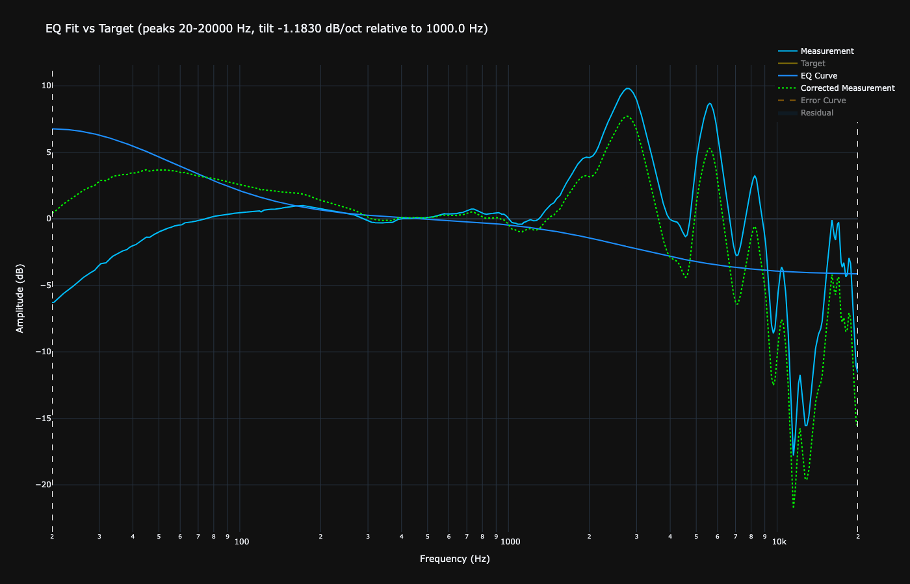
  </div>

```text
Preamp: -6.8 dB
Filter 1: ON PK Fc 20.00 Hz Gain 6.76 dB Q 0.314
Filter 2: ON PK Fc 20000.00 Hz Gain -4.14 dB Q 0.048
```

</details>

<details>
  <summary><strong>ZMFheadphones Auteur Classic</strong></summary>

  <div align="center">
    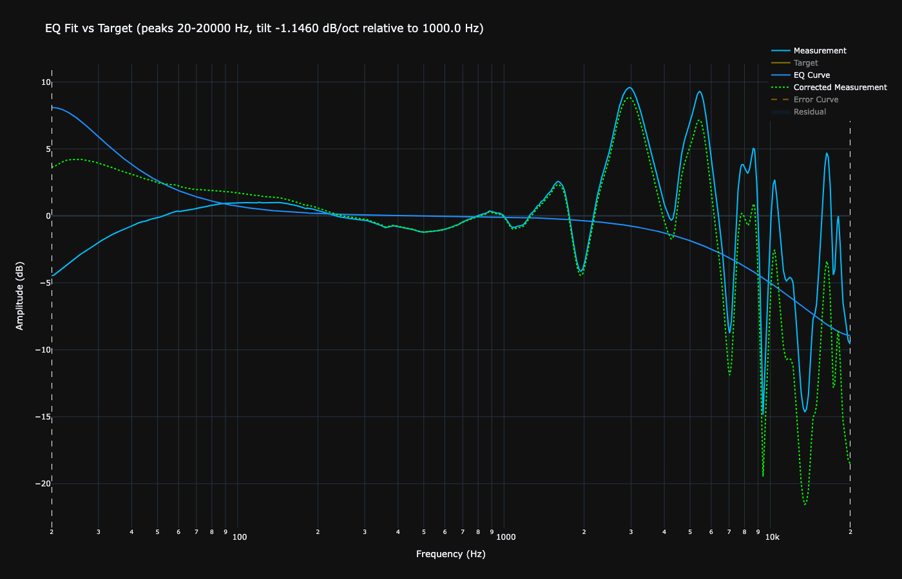
  </div>

```text
Preamp: -8.1 dB
Filter 1: ON PK Fc 20.00 Hz Gain 8.10 dB Q 0.706
Filter 2: ON PK Fc 20000.00 Hz Gain -8.93 dB Q 0.188
```

</details>

<details>
  <summary><strong>ZMFheadphones BOKEH Closed</strong></summary>

  <div align="center">
    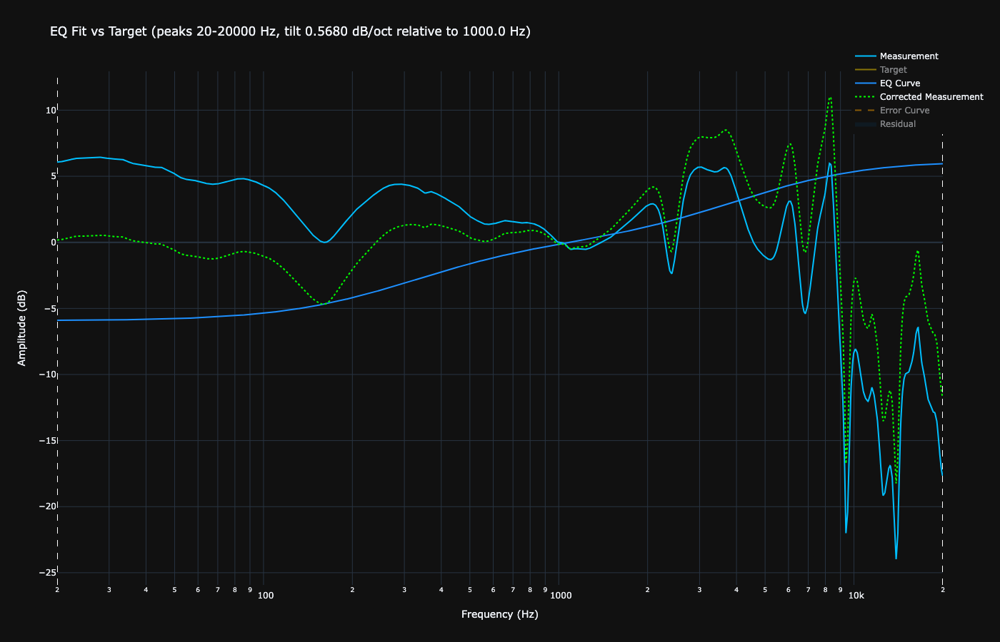
  </div>

```text
Preamp: -5.9 dB
Filter 1: ON PK Fc 57.03 Hz Gain -5.93 dB Q 0.015
Filter 2: ON PK Fc 17105.56 Hz Gain 5.98 dB Q 0.010
```

</details>

<details>
  <summary><strong>ZMFheadphones Caldera Closed</strong></summary>

  <div align="center">
    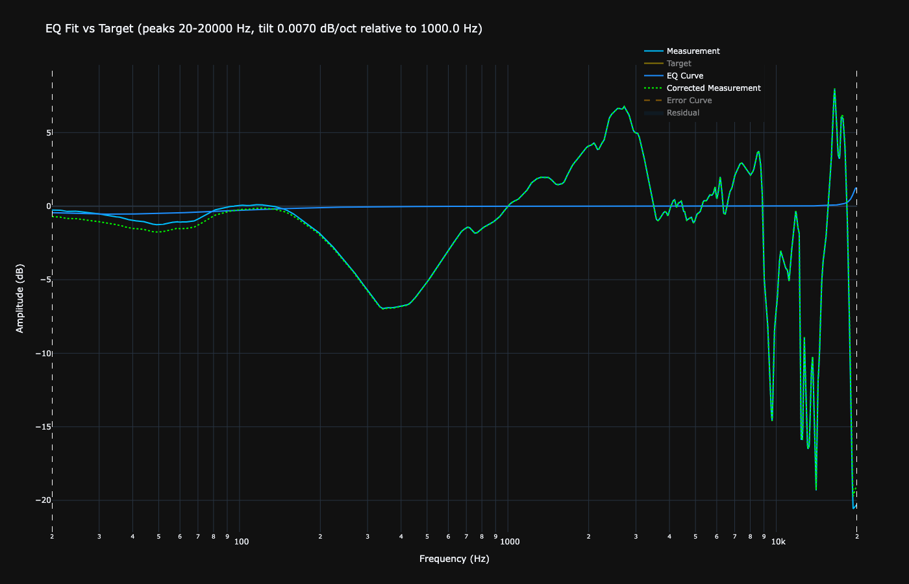
  </div>

```text
Preamp: -1.2 dB
Filter 1: ON PK Fc 35.62 Hz Gain -0.54 dB Q 0.386
Filter 2: ON PK Fc 19808.73 Hz Gain 1.23 dB Q 3.000
```

</details>

<details>
  <summary><strong>ZMFheadphones Verite Closed</strong></summary>

  <div align="center">
    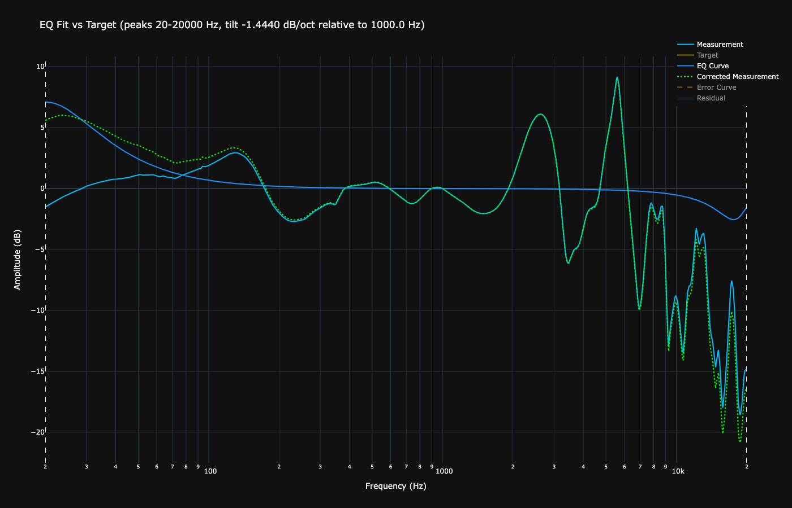
  </div>

```text
Preamp: -7.1 dB
Filter 1: ON PK Fc 20.00 Hz Gain 7.11 dB Q 0.674
Filter 2: ON PK Fc 17558.50 Hz Gain -2.55 dB Q 0.768
```

</details>
